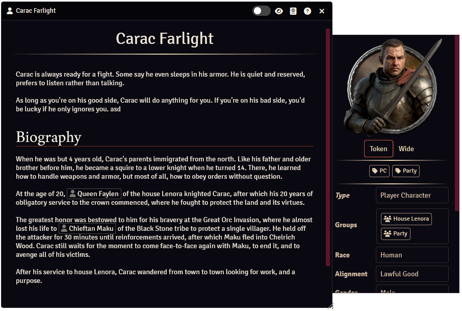
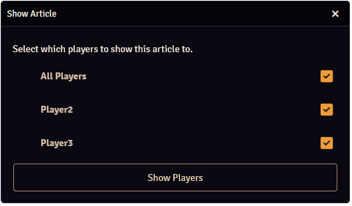
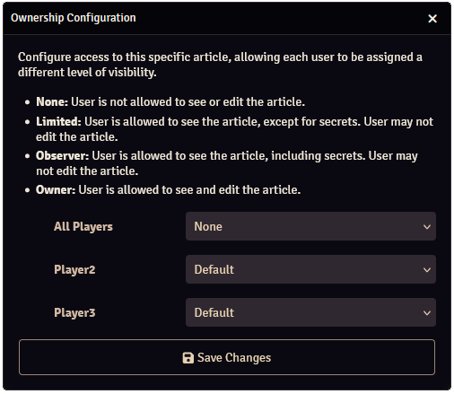
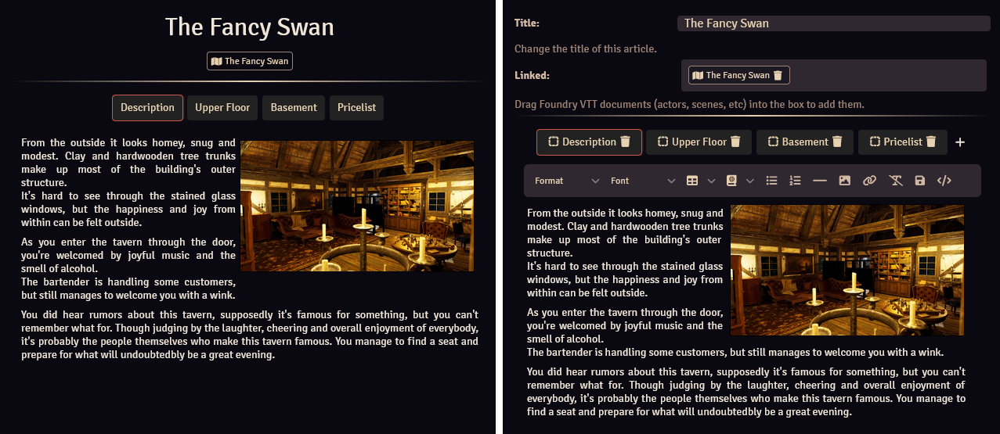
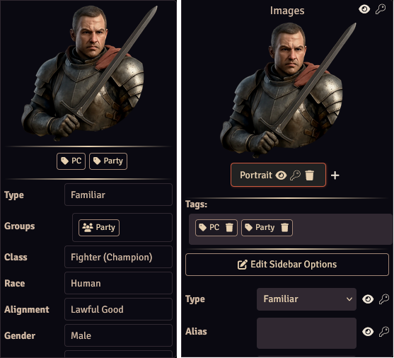
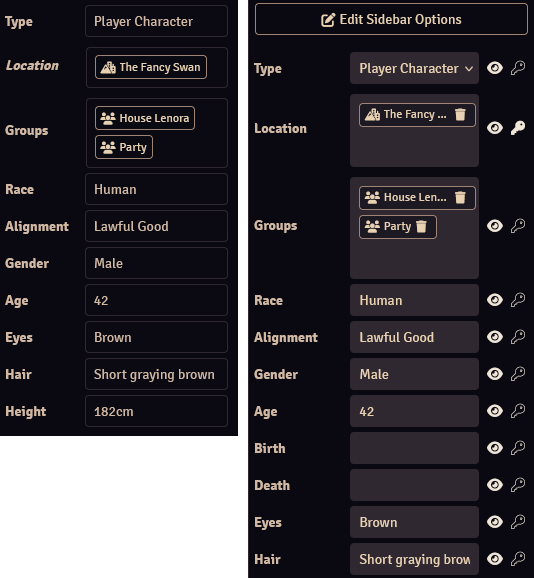

# Articles

Articles are what Worldbuilder is all about.

Articles describe characters, places, items, etc. They display relevant information and images, and articles can link to other articles or Foundry documents (such as actors or scenes). 
This allows you to create a comprehensive database of your world.

Changes can only be made to articles when it's in [edit mode](#playedit-mode).

## Basics

### Article Types
Worldbuilder has 8 different article types:

* <b>Sessions</b>: For session descriptions & notes.
* <b>Quests</b>: To describe quests.
* <b>Characters</b>: To describe characters.
* <b>Groups</b>: To describe groups, such as guilds, organizations, etc.
* <b>Creatures</b>: To describe creatures (that don't fit in the Characters type).
* <b>Locations</b>: To describe locations, such as countries, areas, cities or buildings.
* <b>Object</b>: To describe objects, such as important items.
* <b>Other</b>: For anything that does not fit in the other types.

These article types aren't strictly enforced by Worldbuilder. They are all practically identical and the distinction is only there for convenience. The only real differences between article types are:

* Each article type has their own tab in the [main application](../mainApplication/mainApplication.md)
* Each article type has their own set of [sidebar options](#options)

### Header Buttons
Each article has the following header buttons (at the top of the article):

*  Mode Switch: To switch between [play and edit mode](#playedit-mode)
* :fontawesome-solid-eye: Show Players: Show the article to your players, see [here](#sharing-articles)
* :fontawesome-solid-passport: Copy UUID: Copy the UUID of the article to the clipboard
* :fontawesome-solid-circle-question: Help: Open this documentation
* :fontawesome-solid-x: Close Window: Close the article

### Creating, Deleting & Duplicating Articles
You can create, delete or duplicate an article in one of the [article tabs](../mainApplication/articles.md) of the main application.

<b>Creating Articles</b> 
Click the "+ Create New" button.

<b>Deleting Articles</b> 
Right-click an article and press the ":fontawesome-solid-trash: Delete" button.

<b>Duplicating Articles</b> 
Right-click an article and press the ":fontawesome-solid-copy: Duplicate" button.

### Opening Articles
You can open an article in one of the [article tabs](../mainApplication/articles.md) of the main application, by clicking one of the articles.

### Play/Edit Mode
A worldbuilder article has 2 modes:

1. Play Mode: Articles can only be viewed
2. Edit Mode: Articles can be edited

You can switch between these modes by pressing the slider at the top-right of the article. 
Only players who are the [owner](#ownership) of an article can edit it.

### Sharing Articles

You can share articles with other users by pressing the :fontawesome-solid-eye: icon. 
This will open the article for the selected users, regardless of the [ownership level](#ownership) of the user. [Secrets](#secrets) will not be shown if the user is not allowed to see them.

### Secrets
Secrets are part of an article that are only visible to users with Owner or Observer [ownership](#ownership). 
You can insert a secret into text sections by setting the text type to Secret (under Block), see [here](./pages.md#secrets) for more info. 
Data in the [sidebar](#sidebar) can also be made secret, as is explained in that section.

### Ownership

The ownership level of an article determines what a user can or cannot do with an article. 
You can configure an article's ownership by right-clicking an article in the [main application](../mainApplication/mainApplication.md) and selecting "Configure Ownership".

A default ownership can be configured on the "All Players" line, or the ownership can be configured for each player individually.

The following ownership levels are available:

| Ownership level   | Article is visible| Can see secrets   | Can edit          |
|-------------------|-------------------|-------------------|-------------------|
| None              | :material-close:  | :material-close:  | :material-close:  |
| Limited           | :material-check:  | :material-close:  | :material-close:  |
| Observer          | :material-check:  | :material-check:  | :material-close:  |
| Owner             | :material-check:  | :material-check:  | :material-check:  |

## Main Section

    
    
Main section of an article in play (left) and edit (right) mode.

The main section of articles contain the title of the article, (optionally) linked documents, and pages of text.

### Title
You can edit the title of the article when the article is in [edit mode](#playedit-mode).

### Linked Documents
It is possible to link Foundry documents (Actors, Scenes, etc) to a Worldbuilder article. Linked documents show up at the top of the article, clicking them will open the relevant sheet of that document.

You can change which documents are linked by going into [edit mode](#playedit-mode) and dragging a document (from the Foundry sidebar) onto the box, or deleting it by clicking on the :fontawesome-solid-trash: icon of existing documents.

### Pages
The pages are the main text area of articles. See [here](./pages.md) for more information on them.

## Sidebar

    
    
Sidebar of an article in play (left) and edit (right) mode.

The sidebar of an article contains article [images](#images), [tags](#tags) and [sidebar options](#sidebar-options).

### Images
You can add one or more images to an article. The first image will be used as the article's image in the [main application](../mainApplication/mainApplication.md).

When there is more than 1 image configured, buttons will appear below the image to select which image is displayed.

Clicking on an image in [play mode](#playedit-mode) will open the image in a separate window, which also has the option to show it to other players.

The following actions can be done when the article is in [edit mode](#playedit-mode):

<b>Changing Images</b> 
Click on the image to open the image browser, where a new image can be selected.

<b>Adding Images</b> 
Click on the + button.

<b>Removing Images</b> 
Click on the :fontawesome-solid-trash: icon.

<b>Renaming Images</b> 
Click on the image's name to select the text editor, you can then type a new name.

### Tags
You can add [tags](../tags.md) to an article. Clicking on a tag in [play mode](#playedit-mode) will open the [tag configuration](../tags.md#tag-configuration) for that tag.

See [here](../tags.md#adding--removing-tags-tofrom-an-article) for more information on how to add or remove tags from an article.

### Sidebar Options

    
    
Sidebar options of an article in play (left) and edit (right) mode.

Sidebar options are optional datafields of an article that can be useful to display important information. Depending on the [option type](./sidebarOptions.md#type), the options can display text, numbers or articles. Articles, when clicked, will open that article.

Options are only displayed in [play mode](#playedit-mode) when they have a value, are not hidden, and are not a secret (if the user is not allowed to see secrets).

The options that are available to an article depends on its [type](#article-types), and can be configured in the [options configurator](./sidebarOptions.md).

The following actions can be done when the article is in [edit mode](#playedit-mode):

<b>Changing an Option's Value</b> 
The way you change an option's value depends on the [type](./sidebarOptions.md#type) of the option:

* <b>Textbox:</b> Enter in a new value.
* <b>Number:</b> Enter in a new value.
* <b>Select:</b> Select a value from the drop-down selector.
* <b>Article:</b> Dragging an article from the [main application](../mainApplication/mainApplication.md) into the option's box.
* <b>Article/Text:</b> Adding articles: Dragging an article from the [main application](../mainApplication/mainApplication.md) into the option's box. Adding text: Enter in a new value.

You can delete articles from options by pressing the :fontawesome-solid-trash: icon.

<b>Hiding an Option</b> 
You can hide or unhide an option by clicking the :fontawesome-solid-eye: icon.

<b>Making an option a secret</b> 
You can make an option a secret by clicking the :fontawesome-solid-key: icon.