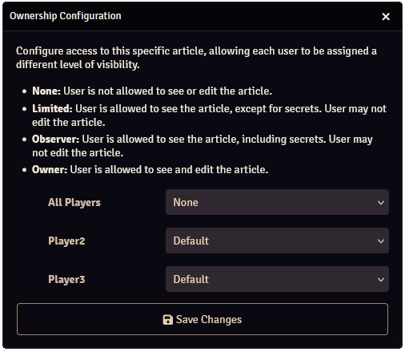

# Articles

Articles are what Worldbuilder is all about. 
Articles describe characters, places, items, etc. They display relevant information and images, and articles can link to other articles or Foundry documents (such as actors or scenes). 
This allows you to create a comprehensive database of your world.

## Basics

### Creating, Deleting & Duplicating Articles
<red>Todo</red>

### Opening Articles
<red>Todo</red>

### Play/Edit Mode
A worldbuilder article has 2 modes:

1. Play Mode: Articles can only be viewed
2. Edit Mode: Articles can be edited

You can switch between these modes by pressing the slider at the top-right of the article. 
Only players who are the [owner](#ownership) of an article can edit it.

### Sharing Articles

You can share articles with other users by pressing the :fontawesome-solid-eye: icon. 
This will open the article for the selected users, regardless of the [ownership level](#ownership) of the user. [Secrets](#secrets) will not be shown if the user is not allowed to.

### Secrets
Secrets are part of an article that are only visible to users with Owner or Observer [ownership](#ownership). 
You can insert a secret into text sections by setting the text type to Secret (under Block), see [here](./textEditing.md#secrets) for more info. 
Data in the [sidebar](#sidebar) can also be made secret, as is explained in that section.

### Ownership

The ownership level of an article determines what a user can or cannot do with an article. 
You can configure an article's ownership by right-clicking an article in the [main application](../mainApplication.md) and selecting "Configure Ownership".

A default ownership can be configured on the "All Players" line, or the ownership can be configured for each player individually.

The following ownership levels are available:

| Ownership level   | Article is visible| Can see secrets   | Can edit          |
|-------------------|-------------------|-------------------|-------------------|
| None              | :material-close:  | :material-close:  | :material-close:  |
| Limited           | :material-check:  | :material-close:  | :material-close:  |
| Observer          | :material-check:  | :material-check:  | :material-close:  |
| Owner             | :material-check:  | :material-check:  | :material-check:  |

## Main Section
<red>Todo</red>

### Name
The name of the article.

### Linked Documents
It is possible to link Foundry documents (Actors, Scenes, etc) to a Worldbuilder article. Linked documents show up at the top of the article, clicking them will open the relevant sheet of that document.

You can change which documents are linked by going into edit mode and dragging a document (from the Foundry sidebar) onto the box, or deleting it by clicking on the :fontawesome-solid-trash: icon of existing documents.

### Pages
<red>Todo</red>

## Sidebar
<red>Todo</red>

### Images
<red>Todo</red>

### Tags
<red>Todo</red>

### Options
<red>Todo</red>

#### Hiding Options
<red>Todo</red>

#### Making Options Secret
<red>Todo</red>