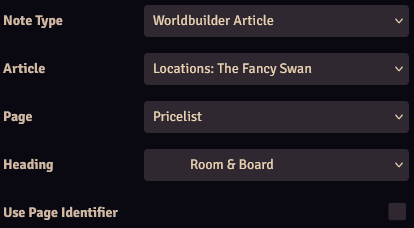

Similar to Foundry's core [map notes](https://foundryvtt.com/article/map-notes/) that allow you to create a note to easily open a journal entry, Worldbuilder allows you to create a map note to open a Worldbuilder article.

Map notes to Worldbuilder articles can be configured to:

* Open a specific article
* Open a specific page within an article
* Open a specific page within an article and scroll to a specific heading

## Creating Map Notes
There are 3 ways to create a map note:

* Creating a normal map note (just like you would for a journal entry), and configuring it for Worldbuilder
* Dragging an article from the [main application](../mainApplication/mainApplication.md) onto the canvas
* Dragging an article's page or heading onto the canvas

In all cases, the map note configuration window will pop up.

## Map Note Configuration

Worldbuilder adds multiple settings to the map note configuration. Only `Note Type` will always be visible, the other settings will appear when they're relevant.

| Setting   | Description   |
|-----------|---------------|
| Note Type | Configure the note to link to a journal entry or a Worldbuilder article   |
| Article   | Article to open (only visible if `Note Type` is set to `Worldbuilder Article`)   |
| Page      | Page to open (only visible if an article is selected) |
| Heading   | Heading to open (only visible if a page and article are selected, and the page has headings) |
| Use Page Identifier   | Use the page identifier to create a note instead of a normal icon, see [here](#page-identifier-map-notes) (only visible if a page and article are selected)   |

## Page Identifier Map Notes

For normal map notes you can select an icon that is displayed on the canvas. If an article links to a specific page, you can choose to replace the icon with the page identifier. This will create a circle with the configured identifier in the center.

See the 2 map notes in the image, with a normal icon on the left, and a page identifier icon on the right. In this case, the page's page identifier is set to `D1`.

You can customize the page identifier note in the map note configuration with:
* <b>Icon Size:</b> Sets the size
* <b>Icon Tint:</b> Sets the color of the circle
* <b>Text Color:</b> Sets the color of the text within the circle