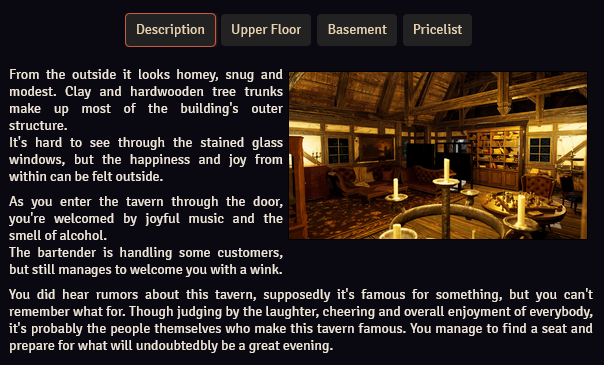
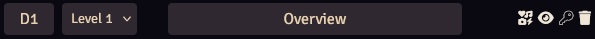
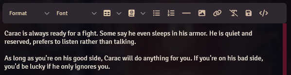
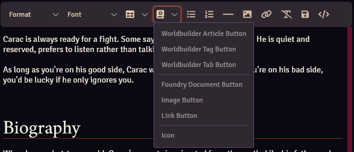
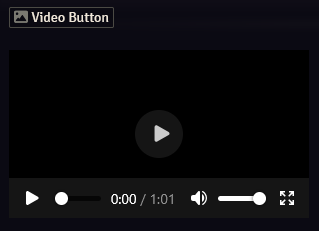
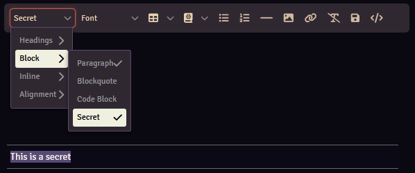
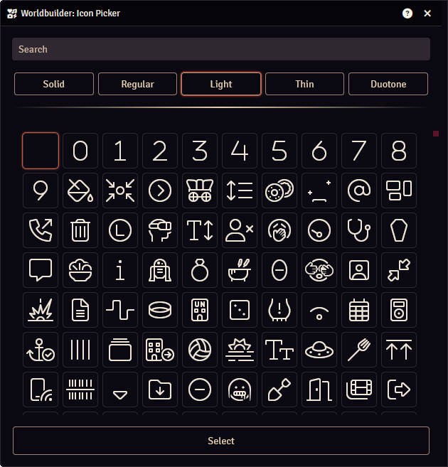

<div class="imgContainer"></div>
Each article can contain one or more pages, which are essentially text documents.

Depending on how "Article Page Navigation" is configured in the [settings](../settings.md#article-page-navigation), the pages of an article will either show up below the article's title (or linked documents section, if configured), or as part of a table of contents.<br>
You can navigate to another page by pressing the page's button or by clicking on the page in the table of contents.<br>

If there is only 1 page, page buttons will not be displayed.

To make any changes to pages the article will need to be in [edit mode](./articles.md#playedit-mode).
<div class="clear"></div>

While in edit mode, you have access to the following options:
<div class="imgContainer"></div>

| Option (from left to right)                   | Action                                                            |
|-----------------------------------------------|-------------------------------------------------------------------|
| Page Identifier                               | Sets the [page identifier](#page-identifier)                      |
| Page Level                                    | Sets the [page level](#page-level)                                |
| Page Title                                    | Sets the page title                                               |
| :fontawesome-solid-icons:                     | Opens the [Icon Picker](#icon-picker) to add an icon to the page  |
| :fontawesome-solid-eye:                       | Hides or unhides the page                                         |
| :fontawesome-solid-key:                       | Makes or unmakes the page secret                                  |
| :fontawesome-solid-trash:                     | Deletes the page                                                  |

Additionally, you can perform the following actions:

* <b>Creating New Pages</b>: You can create new pages. The methods depends on the configured [article page navigation setting](../settings.md#article-page-navigation):
    * Page Buttons: Pressing the `+` icon to the right of all page buttons
    * Table of Contents: Pressing the `Create new page` button at the bottom of the table of contents
* <b>Reordering Pages</b>: You can reorder pages by dragging one page (button) onto another
* <b>Importing a page from another article or a journal</b>: Drag a page (button) from another article or journal onto this article's page buttons or table of contents
* <b>Importing another article or Foundry document</b>: Drag an article or document onto this article's page buttons or table of contents. All pages of the article will be imported, and in the case of a document Worldbuilder will attempt to extract pages from the document, see [here](documentImport.md)

### Page Identifier
Each page can have its own page identifier. This identifier serves 2 purposes:

* <b>Table of Contents:</b> If a page has an identifier, that identifier will be displayed instead of the page's number
* <b>Map Notes:</b> If a map note is created to open the page, the note can be configured to display the page identifier, instead of a normal icon. See [here](./mapNotes.md) for more info.

If a DnD5e `Map Location` journal page is [imported](./documentImport.md), the page identifier will be automatically parsed.

### Page Level
Page level is only available if the [article page navigation setting](../settings.md#article-page-navigation) is set to one of the table of contents settings. In this case, the page's name in the table of contents is shifted to the right. The amount it is shifted depends on the level, where a higher level means a larger shift.<br>
This can be used to create simple page hierarchies.

## Text Editor
<div class="imgContainer"></div>
The Worldbuilder text editor is almost the same as the core Foundry VTT text editor, as used by journal entries.

Only features unique to Worldbuilder will be discussed here.

### Saving Text
Any text written in the text editor will be saved in the following situations:

* By pressing the :fontawesome-solid-floppy-disk: icon
* When changing [modes](./articles.md#playedit-mode)
* When you close the article
* Every 30 seconds

### Inserts
Worldbuilder allows you to insert different kind of buttons, widgets, or other elements into the page. See [here](#page-inserts) for the different kind of inserts and how to configure them.

## Page Inserts
<div class="imgContainer"></div>
Page inserts are either buttons or embedded elements that (usually) can be interacted with.

You could, for example, insert a button to open a different article, or insert an interactive [map](../widgets/map.md).

There are 3 ways to add page inserts to your page:

1. Dragging a Foundry document, worldbuilder article, or worldbuilder widget onto the page. This will place the insert at the location of the cursor.
2. Press the :fontawesome-solid-globe: icon on the page editor toolbar, select the type of insert, and fill in the details in the popup.
3. Manually entering the widget using the correct syntax (see below).

### Insert Syntax
The following syntax is used for page inserts:

```(prefix)(insert type)[data]{label}```<br>
examples:<br>
```
@WB[characters.8GZOzo0RbPZ0iErU]{Carac Farlight}
@IMG[image.webp]{Label}
!WIDGET[map.qvTYLJfSJCpIiGoX]
```

<b>Prefix:</b><br>
The 'prefix' designates whether the insert should be a button (`@`) or an embedded element (`!`).
<div class="imgContainer"></div>
Take the following example, which will create a button with label "Video Button", which will open a popup to play the video if clicked. Below that, a video element is inserted.
```
@VIDEO[video.webm]{Video Button}
!VIDEO[vide.webm controls width:300 height:300 float:left]
```

<b>Type:</b><br>
The type determines the kind of insert. See the table [below](#insert-types) for the different insert types.

<b>Data:</b><br>
Data consists of, at least, the UUID of an article, widget, document, etc, and optional styling data.<br>
The styling data takes HTML style tags, such as:

```
width:100px //set the element width to 100 pixels
height:50px //set the element height to 50 pixels
color:red //set the text color to red
background-color:#00FF00 //set the background color to #00FF00 (green)
```

For example, the following insert will create a button to open a Worldbuilder document with red background and green text:
```
@WB[characters.8GZOzo0RbPZ0iErU background-color:#FF0000 color:#00FF00]{Carac Farlight}
```

Style tags are separated with a space. No space is allowed between the tag and value, so `width:100px` is fine, `width: 100px` is not.

See the table below for more optional other fields.

<b>Label:</b><br>
Only for button inserts.<br>
The label that will be displayed on the button.

### Insert Types

| Type  | Description  |Syntax    | Data Options  |
|--|--|--|--|
| Foundry document button       | Button that opens a Foundry document        | `@UUID[documentUuid]{label}`   | Style tags    |
| Worldbuilder article button   | Button that opens a [Worldbuilder article](../articles/articles.md)    | `@WB[articleUuid]{label}`   | Style tags    |
| Worldbuilder widget button    | Button that opens a [Worldbuilder widget](../widgets/widgets.md)    | `@WIDGET[widgetUuid]{label}`   | Style tags    |
| Worldbuilder tab button       | Button that opens a [Worldbuilder tab](../mainApplication/mainApplication.md#navigating-through-the-app)        | `@TAG[tabName]{label}`    | Style tags    |
| Worldbuilder tag button       | Button that opens a [Worldbuilder tag](../tags.md)        | `@TAG[tagName]{label}`    | Style tags    |
| Image button                  | Button that opens an image popup             | `@IMG[imageUrl]{label}`   | Style tags    |
| Video button                  | Button that opens a video popup             | `@VIDEO[videoUrl]{label}` | Style tags    |
| Link button                   | Button that opens an URL     | `@URL[Url]{label}`        | Style tags    |
| Worldbuilder widget insert    | Embeds a [Widget](../widgets/widgets.md)       | `!WIDGET[widgetUuid]`         | Style tags    |
| Video insert                  | Embeds a video            | `!VIDEO[videoUrl]`        | Style tags<br>`controls`: show video controls<br>`loop`: loop video    |
| PDF insert                    | Embeds a PDF          | `!PDF[pdfUrl]`            | Style tags    |
| Icon insert                   | Embeds an icon                          | `!ICON[fontAwesomeIcon]`  | Style tags  |

### Rolls
You can add rolls to pages, similar to how you can add them to [journal entries](https://foundryvtt.com/article/dice/).<br>
Rolls come in 2 variants:

* <b>Immediate Rolls:</b> These rolls are rolled when the page is opened and display the result. Clicking them allows you to re-roll.
* <b>Deferred Rolls:</b> These rolls are rolled when you click on them. The result will be printed in the chat.

Deferred rolls start with `/r`, while immediate rolls do not.

Rolls can have an optional label, which will be displayed to the right of the roll data.

The syntax is as follows:<br>
`[[roll data]]{label}`<br>
Examples:
```
[[1d10]] //Immediate roll to roll 1d10
[[/r 1d20 + 5]] //Deferred roll to roll 1d20 + 5
[[1d8 + 3]]{bludgeoning damage} //Immediate roll to roll 1d8 + 3 with 'bludgeoning damage' label
```

## Secrets
<div class="imgContainer"></div>
[Secrets](./articles.md#secrets) are parts of an article that are only visible to selected users.

You can make paragraphs secret by selecting the paragraph, then clicking the left-most option in the toolbar, selecting Block and then Secret.

You can also create a secret block first using the same method, and then filling it with text.

While in play mode, a `reveal` or `hide` button is displayed above a secret block for owners of the article. Clicking this will either reveal the secret to all players (that are allowed to view the page), or hide it.

Hidden secret blocks will have a purple background, while revealed ones have a green background.

<div class="clear"></div>

## Icon Picker
<div class="imgContainer"></div>
The Icon Picker provides a way to search for and select [FontAwesome](https://fontawesome.com/) icons.

You can search for icons with the search bar and select how the icon is displayed (solid, regular, light, thin or duotone).

Click one of the icons to select it, then press the Select button.
