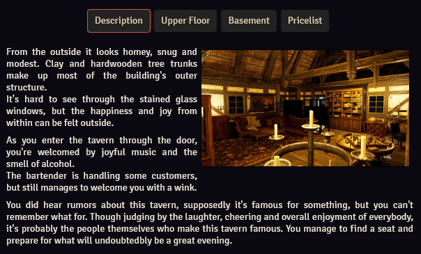
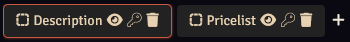
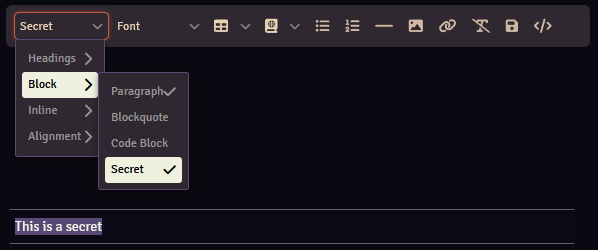

Each article can contain one or more pages, which are essentially text documents.

The pages of an article will show up below the article's title (or linked documents section, if configured). The displayed page is highlighted, and you can navigate to another page by pressing the page's title.

If there is only 1 page, the page title will not be displayed.

To make any changes to pages the article will need to be in [edit mode](./articles.md#playedit-mode).

## Creating and Deleting Pages

Press the :material-plus: button to create a new page, press the :fontawesome-solid-trash: icon to delete a page.

<b>Please note: Deleting pages is irreversible!</b>

## Page Title
Click the title to select the textbox, and rename it.

## Page Icon
You can add icons before the page title. 
Press the :material-dots-square: icon (or previously selected icon) to open the [Icon Picker](#icon-picker).

## Text Editor

The Worldbuilder text editor is almost the same as the core Foundry VTT text editor, as used by journal entries.

Only features unique to Worldbuilder will be discussed here.

### Saving Text
Any text written in the text editor will be saved in the following situations:

* By pressing the :fontawesome-solid-floppy-disk: icon
* When changing [modes](./articles.md#playedit-mode)
* When you close the article
* Every 30 seconds

### Article, Tag & Document Buttons
You can insert buttons that will link to Worldbuilder articles, Worldbuilder tags, or Foundry documents.

You can drag articles or tags from the [main application](../mainApplication/mainApplication.md) into the editor, or you can drag a document from the Foundry sidebar into the editor. Alternatively, you can press the :fontawesome-solid-book-atlas: icon and select one of the options, which will open a popup with options to configure the button.

### Tab Button
You can insert a tab button that, when pressed, will open the selected tab in the [main application](../mainApplication/mainApplication.md).

Press the :fontawesome-solid-book-atlas: icon and select Worldbuilder Tab Button, which will open a popup with options to configure the button.

### Image Buttons
An image button will open a specified image (either on your server or on the internet), and allows you to show that image to your players.

Press the :fontawesome-solid-book-atlas: icon and select Image Button, which will open a popup with options to configure the button.

### Link Buttons
A link button will open a specified internet link in a new window.

Press the :fontawesome-solid-book-atlas: icon and select Link Button, which will open a popup with options to configure the button.

### Icons
You can insert [FontAwesome](https://fontawesome.com/) icons.

Press the :fontawesome-solid-book-atlas: icon and select Icon, which will open the [Icon Picker](#icon-picker).

## Secrets

[Secrets](./articles.md#secrets) are parts of an article that are only visible to selected users.

You can make paragraphs secret by selecting the paragraph, then clicking the left-most option in the toolbar, selecting Block and then Secret.

You can also create a secret block first using the same method, and then filling it with text.

## Icon Picker

The Icon Picker provides a way to search for and select [FontAwesome](https://fontawesome.com/) icons.

You can search for icons with the search bar and select how the icon is displayed (solid, regular, light, thin or duotone).

Click one of the icons to select it, then press the Select button.