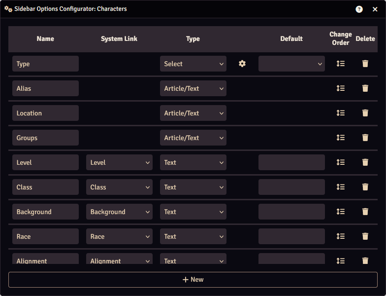

The Options Configurator configures which options will be available in the [sidebar](./articles.md#sidebar) of articles.

The sidebar options for each article type can be configured independently.

You can open the Sidebar Options Configuratior in the following ways:
 
1. In an [article](./articles.md) is opened and in edit mode, press the "Edit Sidebar Options" button in the sidebar.
2. In the [Tab Configuration](../settings.md#tab-configuration) section of the Settings, press one of the the :material-format-columns: buttons.

### Name
The name of the option as it will appear in the sidebar.

### Type
The type of the option, you can select one of the following types:

* <b>Textbox:</b> Accepts any kind of text input.
* <b>Number:</b> Accepts numeric inputs.
* <b>Select:</b> Allows the selection of pre-defined values.
* <b>Article:</b> Accepts Worldbuilder articles.
* <b>Article/Text:</b> Accepts Worldbuilder articles or text.

For the Select type, you can configure the select options by pressing the :material-cog: icon, which expands the option column.

Here, you can rename options, change their order, delete them, or create a new option by entering a value into the empty field at the bottom.

### Default
The default value is what the option will be set to by default.

### Change Order
You can change the order of options by dragging the :material-format-line-spacing: icon.

### Delete Option
You can delete an option by pressing the :fontawesome-solid-trash: icon. 
<b>Please note that deleting an option is irreversible and all articles with this option set will have it deleted.</b>

### Creating a New Option
Press the "+ New" button to create a new option.