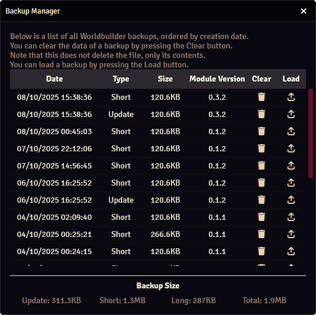

With a module like Worldbuilder, you will be creating a lot of data, and the last thing you'd want is to loose all your hard work.

The Worldbuilder data is stored on your Foundry server, in the [User Data](https://foundryvtt.com/article/user-data/) folder at `[User Data]/worldbuilder`. 
<b>If you delete this folder, you will loose all your data, including any [backups](#automatic-backups)!</b>

Worldbuilder provides 2 methods to prevent data loss, both accessible from the [settings tab](./settings.md):

* [Automatic Backups](#automatic-backups)
* [Importing & Exporting Data](#importing-exporting)

## Automatic Backups

Worldbuilder can automatically create backups of your Worldbuilder data. These backups are stored locally on your Foundry server, and should therefore not be considered "safe backups". Deleting your Worldbuilder data folder or any other form of data loss (e.g. hard drive failure) will not save your data.

Backups create a snapshot of your current Worldbuilder data, which make them useful if you want to undo any changes made since the last backup (such as accidental article deletion).

Worlbuilder provides 3 independent backup types:

* <b>Module Update Backups</b>: Will create a backup whenever Worldbuilder is updated. Mostly useful in case an update (accidentally) breaks something.
* <b>Short Term Backups</b>: Will create a backup at short intervals (on refresh, hourly, or daily).
* <b>Long Term Packups</b>: Will create a backup at long intervals (daily, weekly, or monthly).

The amount of backups that each type will store is set with the `Max` value. The oldest backup will be deleted.

You can force a manual backup by clicking the :material-content-save: button.

### Backup Manager

The Backup Manager gives an overview of all saved backups, and allows you to clear or load backups.

A list of all backups is displayed showing the date and time of the backup, the type of backup, size of the backup, and module version at the time of the backup.

You can clear backups by clicking the :fontawesome-solid-trash: icon, and load a backup by clicking the :fontawesome-solid-upload: icon.

At the bottom of the backup manager you can see the size of your backups.

!!! warning "Loading a backup is irreversible"
    When you load a backup, your current data will be overwritten. This means that this data is not recoverable. It is advisable to first make a backup of your current data.

## Importing & Exporting

Worldbuilder allows you to import and export the Worldbuilder data. It is currently only possible to import and export all of your data.

By pressing the "Export" button, a `.worldbuilder` file is generated and downloaded.

By pressing the "Import" button, you can select a `.worldbuilder` file to import from.

!!! warning "Importing data will overwrite your current data and is irreversible"
    When you import data, your current data will be overwritten. This means that this data is not recoverable. It is advisable to first make a backup of your current data.