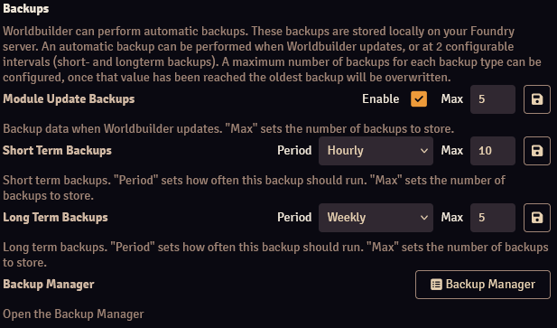
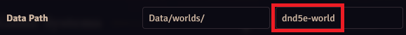

With a module like Worldbuilder, you will be creating a lot of data, and the last thing you'd want is to loose all your hard work.

The Worldbuilder data is stored on your Foundry server, in the [User Data](https://foundryvtt.com/article/user-data/) folder at `[User Data]/worldbuilder`. 
<b>If you delete this folder, you will loose all your data, including any [backups](#automatic-backups)!</b>

Worldbuilder provides 2 methods to prevent data loss, both accessible from the [settings tab](./settings.md):

* [Automatic Backups](#automatic-backups)
* [Importing & Exporting Data](#importing-exporting)

Worldbuilder also offers the option to use the same Worldbuilder data for multiple worlds on the same server through the [Data Id setting].

## Automatic Backups

Worldbuilder can automatically create backups of your Worldbuilder data. These backups are stored locally on your Foundry server, and should therefore not be considered "safe backups". Deleting your Worldbuilder data folder or any other form of data loss (e.g. hard drive failure) will not save your data.

Backups create a snapshot of your current Worldbuilder data, which make them useful if you want to undo any changes made since the last backup (such as accidental article deletion).

Worlbuilder provides 3 independent backup types:

* <b>Module Update Backups</b>: Will create a backup whenever Worldbuilder is updated. Mostly useful in case an update (accidentally) breaks something.
* <b>Short Term Backups</b>: Will create a backup at short intervals (on refresh, hourly, or daily).
* <b>Long Term Packups</b>: Will create a backup at long intervals (daily, weekly, or monthly).

The amount of backups that each type will store is set with the `Max` value. The oldest backup will be deleted.

You can force a manual backup by clicking the :material-content-save: button.

### Backup Manager

The Backup Manager gives an overview of all saved backups, and allows you to clear or load backups.

A list of all backups is displayed showing the date and time of the backup, the type of backup, size of the backup, and module version at the time of the backup.

You can clear backups by clicking the :fontawesome-solid-trash: icon, and load a backup by clicking the :fontawesome-solid-upload: icon.

At the bottom of the backup manager you can see the size of your backups.

!!! warning "Loading a backup is irreversible"
    When you load a backup, your current data will be overwritten. This means that this data is not recoverable. It is advisable to first make a backup of your current data.

## Importing & Exporting

Worldbuilder allows you to import and export the Worldbuilder data. It is currently only possible to import and export all of your data.

By pressing the "Export" button, a `.worldbuilder` file is generated and downloaded.

By pressing the "Import" button, you can select a `.worldbuilder` file to import from.

!!! warning "Importing data will overwrite your current data and is irreversible"
    When you import data, your current data will be overwritten. This means that this data is not recoverable. It is advisable to first make a backup of your current data.

## Data Id
By default, each Foundry world has its own, independent, dataset for Worldbuilder. This means that articles in one world are not accessible to other worlds. You can change this by changing the data id in the [settings](./settings.md).

The default data id is the same as the world's id. You can find your world's id in one of the following ways:

* In the console, run `game.world.id`
* 

In the [Game Worlds](https://foundryvtt.com/article/game-worlds/) tab of the Foundry setup, right click your world and select Edit World. The world id will be the second textbox in the Data Path field (see the image).

You can access the data from another world by setting that world's id as the Data Id. You will no longer have access to the Worldbuilder data that you had created using the original Data Id, but this data is not lost. Setting the Data Id back to that world's id will allow you to access that data again.

When two or more worlds share Worldbuilder data, any changes are made bi-directionally. This means that changes in world 1 will also be visible in world 2, and vice versa.

If you set Data Id to a value that is not an existing world id, a new dataset will be created.

Currently, it is only possible to share all of Worldbuilder's data. Selectively sharing specific articles will be added in the future.