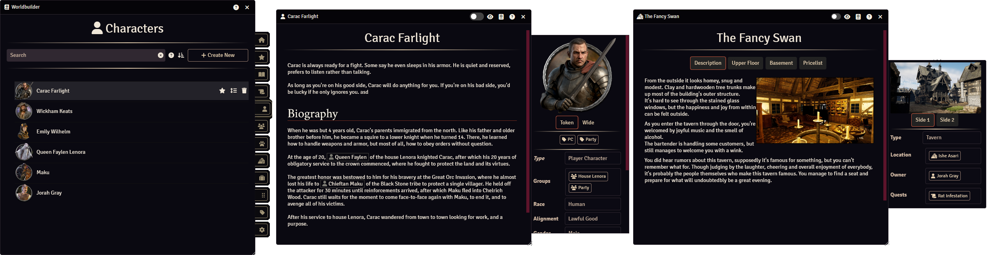

# Worldbuilder Documentation

Welcome to the Worldbuilder documentation. 
You can navigate this documentation by clicking on the chapters at the top of this page, or the sub-chapters on the left. 
Use the search function on the top-right to search for specific things.

Here is a list of useful links:

* [Getting Started](./gettingStarted.md): Instructions on installing and using the module
* [Roadmap](./roadmap.md): Planned features
* [Feedback & Issues](#feedback-issues): For bug reports and feature requests

## Worldbuilder
Worldbuilder is your all-in-one campaign management and worldbuilding toolkit, seamlessly integrated in [Foundry VTT](https://foundryvtt.com).

Build immersive worlds by creating and linking articles for everything in your game: sessions, quests, characters, locations, and more. Craft an expanding web of lore and let your players explore the connections, or keep it secret until the time is right.

Highly customizable, Worldbuilder puts you in full control. Decide exactly what information matters for each article, and fine-tune how this information is displayed for you, specific players, or for everyone.

To unlock the full power of Worldbuilder, a subscription to the [Material Foundry Patreon](https://www.patreon.com/materialfoundry) at the Material Apprentice tier (or higher) is required.
Want to try it first? Give the free [demo](./demo.md) version a try.

<iframe style="display: block; margin: 0 auto;" title="YouTube video player" src="https://www.youtube.com/embed/NmmvDtDbnS0?si=pr9EtvvD82XdcbBt" width="560" height="315" frameborder="0" allowfullscreen=""></iframe>

## Combatibility

<b>Foundry VTT</b>: v12-v13 
<b>Module incompatibilities</b>: None known

## Feedback & Issues
If you have any suggestions or bugs to report, feel free to:

* [Create an issue on Github](https://github.com/MaterialFoundry/Worldbuilder/issues)
* Post on the [Material Foundry Discord server](https://discord.gg/3hd4G6TkmA)
* DM me on Discord (@materialfoundry)
* Send an email: info@materialfoundry.nl