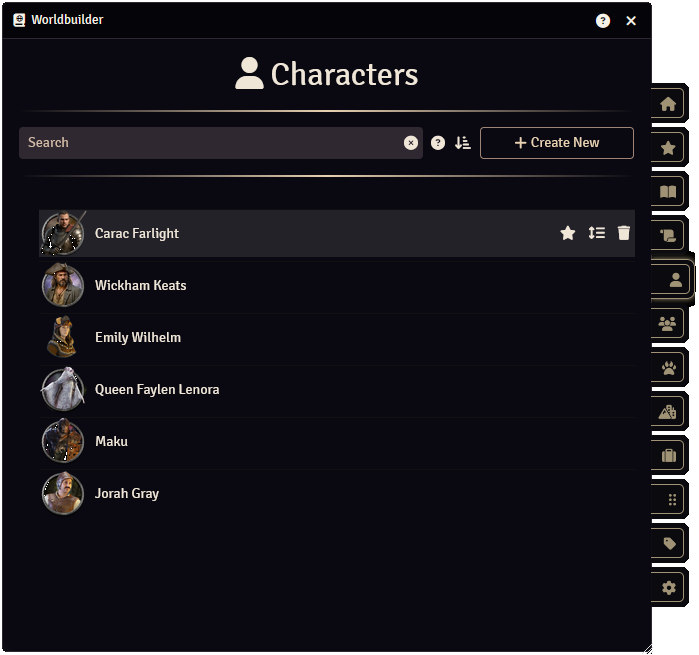

Articles are the main source of data within Worldbuilder. They contain information about sessions, quests, characters, etc. For more information on articles, click [here](../articles/articles.md). 
Each article type has their own tab.

## Search Bar
At the top of the tab you will find the search bar. This allows you to search through all Worldbuilder articles of the tab type. You can find more information on searching [here](./searching.md).

## Sorting
You can configure how the articles are sorted by pressing the relevant button next to the search bar:

* <b>:fontawesome-solid-arrow-down-short-wide: Manually</b>: Sort articles manually. You can reorder articles by hovering over the article, holding down the :fontawesome-solid-grip-lines: icon and dragging it to another position.
* <b>:fontawesome-solid-arrow-down-a-z: Alphabetically (A-Z)</b>: Sort articles alphabetically, with A at the top.
* <b>:fontawesome-solid-arrow-down-z-a: Alphabetically (Z-A)</b>: Sort articles alphabetically, with Z at the top.

## Opening an Article
You can open an article by clicking on the article. This will open the [article window](../articles/articles.md).

## Creating New Articles
You can create new articles by clicking the "+ Create New" button, next to the search bar.

## Deleting Articles
Right-click an article and press the ":fontawesome-solid-trash: Delete" button.

## Duplicating Articles
Right-click an article and press the ":fontawesome-solid-copy: Duplicate" button.

## Making Articles Favorites
Favorite articles will show up in the [Favorites tab](favorites.md). 
You can favorite an article by hovering over the article and pressing the :fontawesome-solid-star: icon.