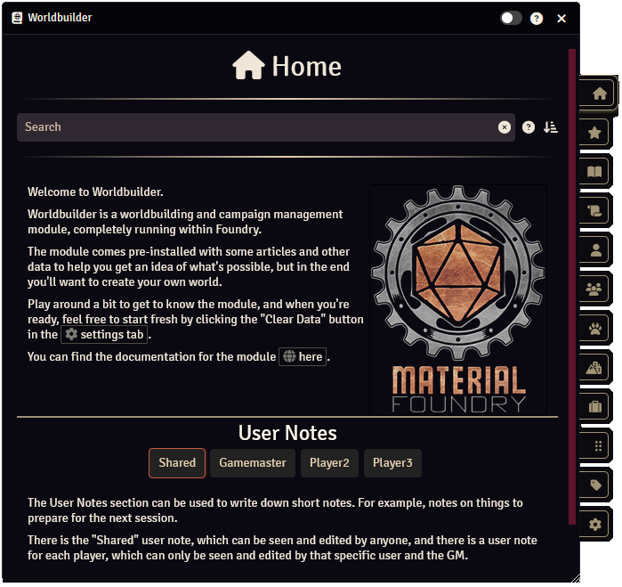
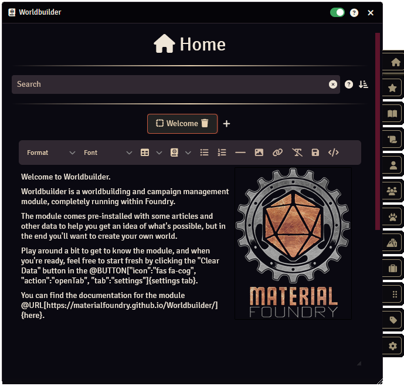

The Home tab is the first tab you will see when you open Worldbuilder.

This tab is meant to display a welcome message or information that you want easy access to.

The tab consists of 3 sections:

* <b>[Search & Articles](#search--articles)</b>: Can be used to search through all Worldbuilder articles.
* <b>[GM Set Pages](#gm-set-pages)</b>: Pages of information that can be configured by the GM.
* <b>[User Notes](#user-notes)</b>: Notes that can be written by users.

## Search & Articles
The search bar allows you to search through all Worldbuilder articles. You can find more information on searching [here](./searching.md).

When you enter a search term, the other sections of the Home tab will be hidden, instead a list of found articles will be displayed.

## GM Set Pages

Gm set pages are pages of information that can be configured by the GM. 
This is meant for, for example, welcome information, essential background information on the world, or anything the GM finds relevant.

Editing these pages is identical to editing article pages, see [here](../articles/pages.md).

## User Notes
User notes are notes that are editable by users. It could be used to write down short notes. For example, notes on things to prepare for the next session.

There is the "Shared" user note, which can be seen and edited by anyone, and there is a user note for each player, which can only be seen and edited by that specific user and the GM.

If you do not want to use the User Notes section, you can hide it by going into edit mode and pressing the :fontawesome-solid-eye: icon.