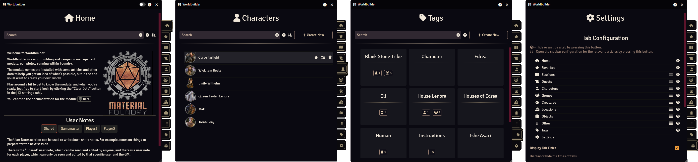

The main application is the primary access point for Worldbuilder. Almost everything Worldbuilder does is done through the main application.

    
    
Different tabs of the main application. From left to right: Home, Characters, Tags, Settings.

## Basics

### Opening the App
The "Game Settings" sidebar tab of Foundry has a new "Material Foundry" section. 
To open Worldbuilder, press the "Worldbuilder" button.

### Navigating through the App
On the right side of the app you will find multiple tabs. You can navigate through these tabs by pressing on them. The active tab is slightly bigger than the others.

## Tabs
The Worldbuilder application has multiple tabs. Clicking on these will open a different part of Worldbuilder.

### Home
The Home tab is the first tab you will see when you open Worldbuilder. This tab is meant to display a welcome message or information that you want easy access to.

Click [here](./home.md) for more information on using the home tab.

### Favorites
The Favorite tab shows articles that have been tagged as favorite in one of the [article](./articles.md) tabs. 
This tab works exactly the same as the other article tabs, except that you cannot create new articles here.

### Article Tabs
[Articles](../articles/articles.md) are the main source of data within Worldbuilder. They contain information about sessions, quests, characters, etc.
Each article type has their own tab, which are identical, except for which articles they display.

Click [here](./articles.md) for more information on using the article tabs.

### Tags
Tags are a way to categorize or group multiple [articles](../articles/articles.md) together.

Click [here](../tags.md) for more information on using the tags tab.

### Settings
The settings tag contains all the Worlbuilder [settings](../settings.md).