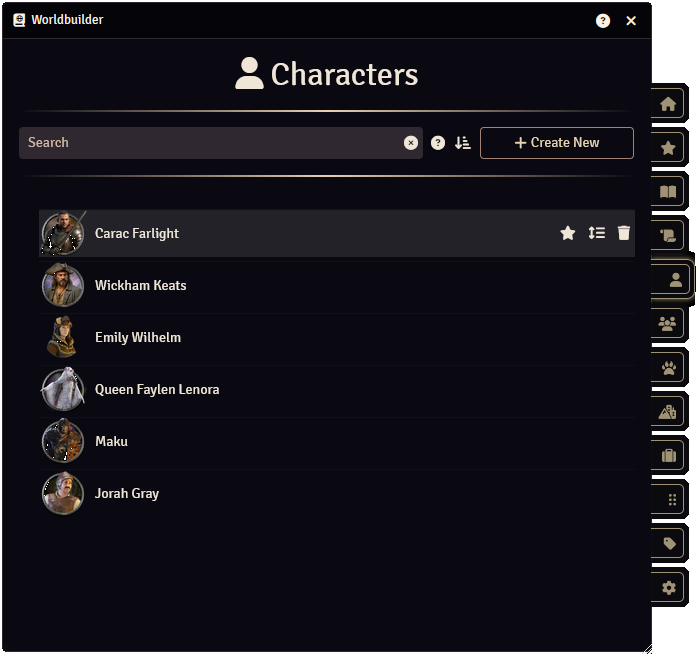
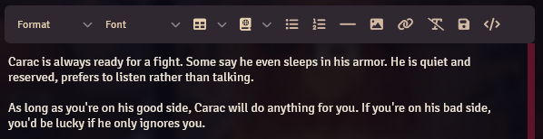

This quick start guide will guide you through the basics of using Worldbuilder:

1. Navigating the main application
2. Creating and editing an article

This guide assumes that you've gone through the [getting started](./gettingStarted.md) steps and have Worldbuilder installed and enabled.

## Navigating the Main Application

The main application of Worldbuilder is the starting point for everything you do with the module. It shows all articles, categorized by article types, allows you to open and create articles, and more.

To open the application, head the Game Settings sidebar tab (:material-cogs:), look for the Material Foundry section and press the :fontawesome-solid-book-atlas: Worldbuilder button.

On the right of the application you will find multiple tabs, clicking these will display the corresponding data in the main section of the application.

See [here](./mainApplication/mainApplication.md) for more information on the main application and the different tabs.

## Creating and Editing an Article
[Articles](./articles/articles.md) describe characters, places, items, or whatever you want. They can have text descriptions, images and other relevant information.

We will create a basic Character article, but the following will apply to all article types.

### Creating an Article
1. Open the Characters tab (:fontawesome-solid-user:) of the main application, you now have 2 options to create an article, try them both:
    1. Click the Create New button to create a new article. This article will be empty.
    2. Drag an actor from the Actors sidebar tab onto the Worlbuilder application, in the popup make sure Article Type is set to Characters, and press Import. This will create a new article that will be pre-filled (as far as Worldbuilder is able to fill it, see [here](./articles/articles.md#document-import) for more info).

2. A article window should have opened. In the header of the article you can switch between Play and Edit mode by clicking the Change Mode slider (). Switch it to Edit mode (the slider will turn green).
3. Change the name/title of the article by writing something in the Title field.
4. Drag an actor from the Actors sidebar tab onto the Linked field. In Play mode, this will create a button that you can click to open that actor's character sheet.

### Creating and Editing Pages
1. Create 2 new pages by pressing the + button below the Linked field twice. You have now created 2 pages and corresponding buttons that you can edit.
2. Click on the "New Page" text of one of the new buttons, and give the page a name. Do the same for the other page.
3. Click one of the :material-dots-square: icons to open the [Icon Picker](./articles/pages.md#icon-picker), select an icon and click Select. You have now given that page an icon.

4. Use the [text editor](./articles/pages.md#text-editor) to write something. You can write something on a different page by clicking on that page's button.
5. Drag an actor from the Actors sidebar tab onto the text edit. When in play mode this will turn into a button that you can press to open that actor's character sheet. You can do similar things with items, scenes, etc. You can also drag other Worldbuilder articles onto the text editor.
6. Click the Change Mode slider () to go into Play mode and look at the result. From the top to the bottom you should have:
    * The name/title of the article.
    * A button for a linked Foundry document that opens the character sheet of an actor.
    * 2 page buttons that when pressed will display that page's text.
    * At least 1 page with a button that will open the character sheet of an actor.

### Adding Images
1. Go back into Edit mode and click on the + button under Images twice to create 2 new images.
2. Click on the newly appeared image to open the Image Browser, and select an image. Click on the second button and then do the same for the second image.
3. Click on the "New" text in the image buttons to change the name of the images.
4. In Play mode, the sidebar should now show up and display one of the images. Click the image buttons to select which image is displayed. Click the image to open the image viewer.

### Adding Tags
1. In Edit mode, click on the Tags field. If you have pre-existing tags you should see a drop-down menu with all available tags. Select one (if any exist) to add it to the article.
2. Create a new tag by writing something in the Tags field. Notice that the pre-existing tags will be filtered if any contain the same text (e.g. writing "PC" will display the "PC"and "NPC" tags). Enter, for example, "Tutorial Tag", and press enter. This new tag will be added to the [Tags tab](./tags.md#tags-tab).
3. In Play mode, the sidebar should now display any tags you added. Clicking one of them will open the tag's [configuration](./tags.md#tag-configuration).

### Adding Sidebar Options
1. In Edit mode, click the Edit Sidebar Options button, which will open the [Sidebar Options Configurator](./articles/sidebarOptions.md).
2. Create a new option by clicking the New button at the bottom.
3. Give the new option the "Origin" name and change the Type to Select.
4. Create another option and give it the "Size" name and change the Type to Select.
5. Press the :material-cog: icon to expand the select options.

6. Create the following options by entering the text into the empty field below "Select Options":
    * Small
    * Medium
    * Large
7. Close the window and go back to the article, toggle the mode to Play and back to Edit to see the new options appear in the sidebar.
8. You can now set the options. For the Origin option, enter "Tutorial", for the Size option, select Large.
9. Go back to Play mode and notice that these options appear in the sidebar. Only filled in options will appear. You can optionally choose to hide options from all players by pressing the :fontawesome-solid-eye: icon, or make an option secret (hide it for players that do not have the right [ownership level](./articles/articles.md#ownership) to see secrets) by pressing the :fontawesome-solid-key: icon.

### Searching for Articles
If you have multiple articles, you might want to find a specific one using the [search bar](./mainApplication/searching.md).

1. In the Characters tab, enter (part of) the name of the character you want to find. Only characters with matching names will be displayed.
2. In the search bar, enter "origin:tutorial". The above created article should show up.
3. In the search bar, enter "size:large". The above created article should show up.

### Allow Users to Edit the Article
1. In the Characters tab, right-click the above created article.
2. Select Configure Ownership, which will open a new window.
3. Set All Players to Owner
4. All of your players will now be able to view and edit the article.