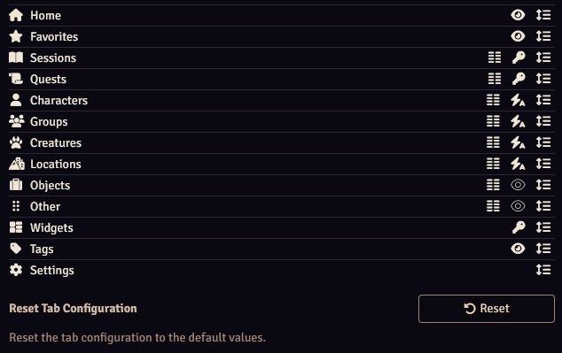

The settings tab of the [main application](./mainApplication/mainApplication.md) gives access to the Worldbuilder settings.

## Tab Configuration

The Tab Configuration section allows you to configure the tabs of the [main application](./mainApplication/mainApplication.md).

Press the :fontawesome-solid-eye: icon to hide or unhide tabs. 
Press the :material-format-columns: icon to enter the [sidebar options configuration](./articles/sidebarOptions.md).

<b>Display Tab Titles</b> 
When enabled, the titles of tabs will be displayed.

## Data Management

The Data Management section handles settings related to data management.

<b>Force Key Name (only on [the Forge](https://forge-vtt.com/))</b> 
Enter in the key name of your Worlbuilder folder to share the data with your players. See [here](./gettingStarted.md#the-forge) for more info.

<b>Clear Data</b> 
Opens a dialog where you can select data to be cleared.

## Updates

<b>Current Version</b> 
The version of Worldbuilder that you have installed.

<b>Latest Version</b> 
The latest version of Worldbuilder that is available.

<b>Update Notifications</b> 
Enable or disable notifications when a Worldbuilder update is available.

