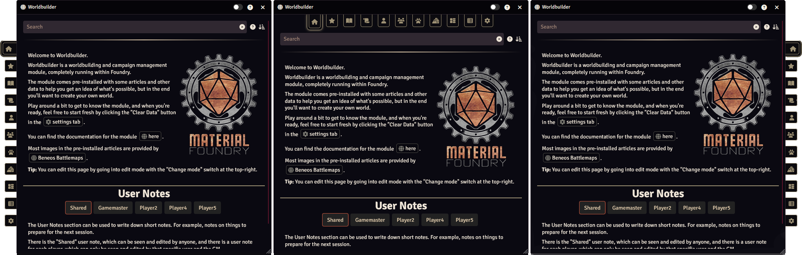
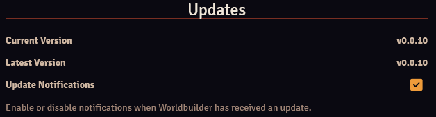

The settings tab of the [main application](./mainApplication/mainApplication.md) gives access to the Worldbuilder settings.

## Tab Configuration

The Tab Configuration section allows you to configure the tabs of the [main application](./mainApplication/mainApplication.md), and it allows you to open the [sidebar options configuration](./articles/sidebarOptions.md) for the relevant articles (:material-format-columns:).

#### Tab Name
You can change the name of a tab by click on one of the names. This allows you to input a new name.

#### Tab Icon
You can change the icon of a tab by clicking on one of the existing icons. This will open the [Icon Picker](./articles/pages.md#icon-picker). 
Tabs must have an icon, so selecting the empty icon will do nothing.

#### Tab Visibility
You can configure which tabs are visible to whom by clicking the visibility icon, this will change the visibility mode:

* :fontawesome-solid-eye: Visible: The tab will be visible to all players
* :fontawesome-solid-key: GM Only: The tab will only be visible to gamemasters
* :material-flash-auto: Auto: The tab will always be visible to gamemasters, and automatically for players (they will need to have at least one article with Limited [ownership](./articles/articles.md#ownership) or higher for the tab to show up)
* :fontawesome-regular-eye: Hidden: The tab will be hidden to all players

The visibility of the settings tab cannot be changed. It is not visible to players and always visible to gamemasters.

#### Tab Order
You can reorder tabs by dragging the right-most icon.

## User Interface

The user interface sections allows some configuration over how Worldbuilder looks and handles.

#### Display Tab Titles
When enabled, the titles of tabs will be displayed.

### Tab Navigation
With the Tab Navigation setting you can configure where the buttons to navigate throught the main application are located. Either on the right, the left, or the top.

    
    
The different tab navigation options, from left to right: "Left", "Top" and "Right".

### Article Page Navigation
When articles get bigger and have multiple pages, a method is necessary to navigate through the articles. 
Worldbuilder offers 3 options;

* <b>Table of Contents - Sidebar</b>: A table of contents is located as a sidebar on the left of the article.
* <b>Table of Contents - Column</b>: A table of contents is located within the article window, as a column on the left.
* <b>Buttons</b>: Page buttons are located on the top.

You can navigate to a different page by pressing one of the page buttons, or by pressing the page in the table of contents. When one of the table of contents options is selected, pressing a page will scroll the article to the top of that page. 
The page headers in the table of contents are automatically generated, and pressing them will scroll the page to that header.

    
    
The different article page navigation options, from left to right: "Table of Contents - Sidebar", "Table of Contents - Column" and "Buttons".

## Data Management

The Data Management section handles settings related to data management.

#### Force Key Name
Only on [the Forge](https://forge-vtt.com/). 
Enter in the key name of your Worlbuilder folder to share the data with your players. See [here](./gettingStarted.md#the-forge) for more info.

#### Backups
See [here](./dataManagement.md#automatic-backups).

#### Import/Export Data
See [here](./dataManagement.md#importing-exporting).

#### Clear Data
Opens a dialog where you can select data to be cleared.

#### Data Id
Data id sets which Worldbuilder dataset to use. See [here](./dataManagement.md#data-id).

## Updates

#### Current Version
The version of Worldbuilder that you have installed.

### Latest Version
The latest version of Worldbuilder that is available.

#### Update Notifications
Enable or disable notifications when a Worldbuilder update is available.

