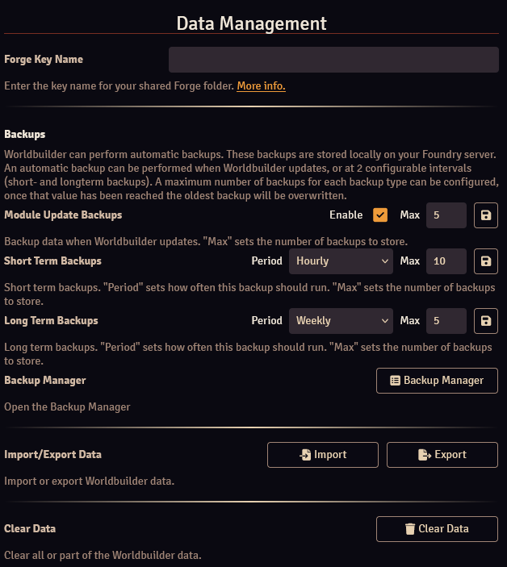

The settings tab of the [main application](./mainApplication/mainApplication.md) gives access to the Worldbuilder settings.

## Tab Configuration

The Tab Configuration section allows you to configure the tabs of the [main application](./mainApplication/mainApplication.md), and opening the [sidebar options configuration](./articles/sidebarOptions.md) for the relevant articles (:material-format-columns:).

You can configure which tabs are visible to whom by clicking the right-most icon, this will change the visibility mode:

* :fontawesome-solid-eye: Visible: The tab will be visible to all players
* :fontawesome-solid-key: GM Only: The tab will only be visible to gamemasters
* :material-flash-auto: Auto: The tab will always be visible to gamemasters, and automatically for players (they will need to have at least one article with Limited [ownership](./articles/articles.md#ownership) or higher for the tab to show up)
* :fontawesome-regular-eye: Hidden: The tab will be hidden to all players

The visibility of the settings tab cannot be changed. It is not visible to players and always visible to gamemasters.

<b>Display Tab Titles</b> 
When enabled, the titles of tabs will be displayed.

## Data Management

The Data Management section handles settings related to data management.

<b>Force Key Name (only on [the Forge](https://forge-vtt.com/))</b> 
Enter in the key name of your Worlbuilder folder to share the data with your players. See [here](./gettingStarted.md#the-forge) for more info.

<b>Backups</b> 
See [here](./dataManagement.md#automatic-backups).

<b>Import/Export Data</b> 
See [here](./dataManagement.md#importing-exporting).

<b>Clear Data</b> 
Opens a dialog where you can select data to be cleared.

<b>Data Id</b> 
Data id sets which Worldbuilder dataset to use. See [here](./dataManagement.md#data-id).

## Updates

<b>Current Version</b> 
The version of Worldbuilder that you have installed.

<b>Latest Version</b> 
The latest version of Worldbuilder that is available.

<b>Update Notifications</b> 
Enable or disable notifications when a Worldbuilder update is available.

