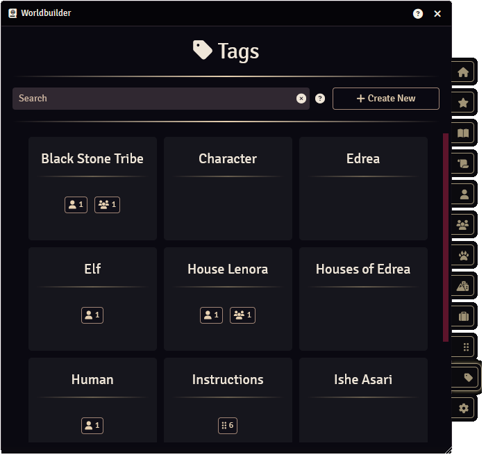
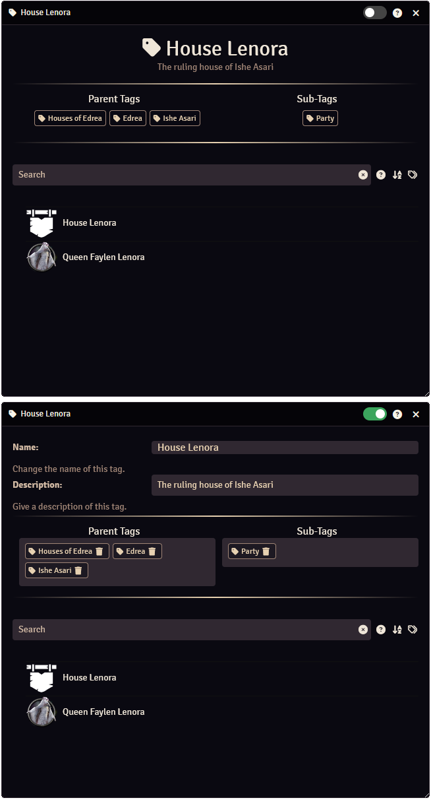

Tags are a way to categorize or group multiple [articles](./articles/articles.md) together. 

For example: 
You could have a "Party" tag, which you attach to each member of the party (each player character). 
You could have an "Important NPC" tag, allowing you to easily find all important NPCs. 
You could have a tag for a city, allowing you to easily find all articles related to that city.

Articles can have multiple tags attached to them, allowing a complex web of interconnections.

## Tags Tab

The Tags tab of the [main application](./mainApplication/mainApplication.md) gives an overview of all tags. 
You can search for tags using the search bar, see [here](./mainApplication/searching.md) for more info on how to use the search function. 
You can create new tags by pressing the "Create New" button.

At the bottom you will find a grid of all tags. Each grid space contains the name of the tag and the number of articles of each article type that have that tag attached to them. 
When you hover over a grid space, a :fontawesome-solid-trash: icon will appear, clicking this will delete the tag. 
By pressing on a grid space, the [tag configuration](#tag-configuration) will open for that tag.

 

## Creating & Deleting Tags
### Creating Tags
There are multiple ways to create a new tag:

<b>Tags Tab</b> 
In the [Tags tab](#tags-tab) of the [main application](./mainApplication/mainApplication.md) you can press the "Create New" button to create a new tag. 
This will create a tag with name "New" (or "New 2", "New 3", etc, if the name already exists), and will open the [tag configuration](#tag-configuration).

<b>Article</b> 
When an [article](./articles/articles.md) is open and in edit mode, you can enter a tag name into the "Tags" field in the sidebar. If that tag doesn't exist yet, it will be created.

### Deleting Tags
You can delete tags in the [Tags tab](#tags-tab) of the [main application](./mainApplication/mainApplication.md) by hovering over the tag and pressing the :fontawesome-solid-trash: icon.

## Adding & Removing Tags to/from an Article
### Adding Tags
There are multiple ways to add a tag to an article:

<b>Article</b> 
When an [article](./articles/articles.md) is open and in edit mode, you can add new tags to the "Tags" field in the sidebar using one of the following methods:

1. Clicking on the "Tags" field will display a drop-down menu with all available tags, select one to add it to the article.
2. Enter a tag name into the "Tags" field, a drop-down menu with all available tags with similar (filtered) tag names will be displayed. Select one to add it to the article, or press enter to add the filled in tag to the article. If that tag does not exist yet, it will be created.
3. Dragging a tag from the [Tags tab](#tags-tab) onto the "Tags" field.

<b>Tag Configuration</b> 
With the tag configuration open and in edit mode, you can drag an article from the [main application](./mainApplication/mainApplication.md) onto the tag configuration to add that tag to the article.

### Removing Tags
There are multiple ways to remove a tag from an article:

<b>Article</b> 
When an [article](./articles/articles.md) is open and in edit mode, you can remove tags from the "Tags" field in the sidebar by pressing the :fontawesome-solid-trash: icon.

<b>Tag Configuration</b> 
With the tag configuration open and in edit mode, you can remove a tag from an article by hovering over the article and pressing the trash button.

## Tag Configuration

### Edit Mode
You can enter or exit edit mode by pressing the slider in the top of the tag configuration.

### Tag Name
The tag name is a unique name for the tag.

### Tag Description
The tag description can be used to add a short description of what the tag is meant for.

### Parent & Sub-Tags
Tags can have parent and sub-tags, these create basic tag hierarchies. 
You could, for example, have a "Regions" tag, which you use to categorize all regions of your world. You could then add tags for these regions as sub-tags, to indicate that these region tags are part of a bigger "Regions" tag (in this case, the "Regions" tag will automatically be the parent tag of the region tags).

<b>Adding Parent & Sub-Tags</b> 
You can add parent or sub-tags using one of the following methods:

1. Clicking on the "Parent Tags" or "Sub-Tags" field will display a drop-down menu with all available tags, select one to add it.
2. Enter a tag name into the "Parent Tags" or "Sub-Tags" field, a drop-down menu with all available tags with similar (filtered) tag names will be displayed. Select one to add it, or press enter to add the filled in tag. If that tag does not exist yet, it will be created.
3. Dragging a tag from the [Tags tab](#tags-tab) onto the "Parent Tags" or "Sub-Tags" field.

<b>Removing Parent & Sub-Tags</b> 
With the tag configuration in edit mode, you can remove tags from the "Parent Tags" or "Sub-Tags" field by pressing the :fontawesome-solid-trash: icon.

### Articles
The bottom section of the tag configuration displays all articles that have the tag attached. 
You can search for articles using the "Search" field, see [here](./mainApplication/searching.md) for more info on how to use the search function. 
You can select to order the articles alphabetically from A to Z, or from Z to A, by pressing the :fontawesome-solid-arrow-down-a-z: or :fontawesome-solid-arrow-down-z-a: icon next to the search bar. 
Can can select to include all articles that have one or more of the sub-tags of this tag, by pressing the "Include Sub-Tags" icon next to the search bar.

Clicking one of the articles will open the article. 
If the tag configuration is in edit mode and you hover over an article, a :fontawesome-solid-trash: icon will appear. Clicking this icon will remove the tag from that article.
