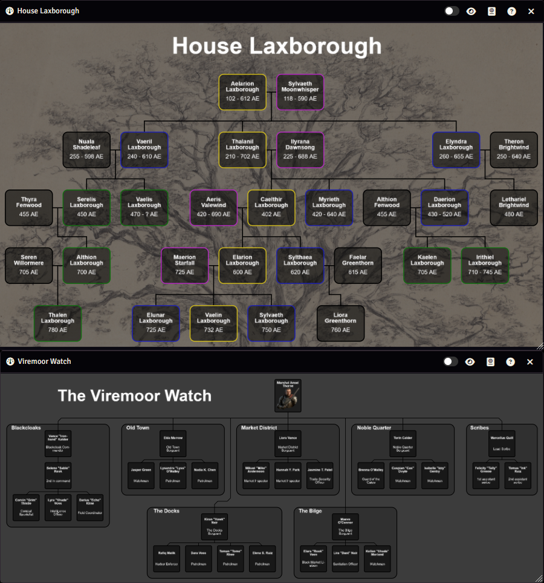
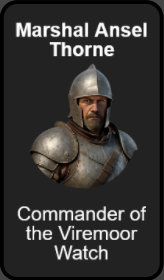
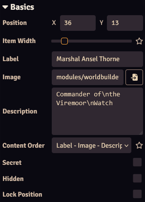
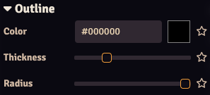
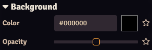
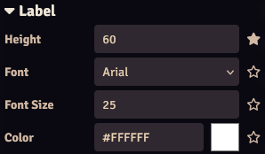
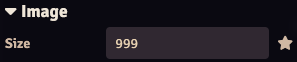
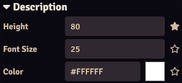

# Hierarchy Widget

The hierarchy widget displays hierarchy structures, such as family trees or organizational structures

Take, for example, the hierarchies shown on the right, which show a family tree of "House Laxborough" (top) and the organizational structure of "The Viremoor Watch" (bottom).

Depending on how the widget is configured, you can:

* Pan around (drag & hold the left mouse button) 
* Zoom in/out (mousewheel)
* Hover over an item to display text or a page from an article
* Click an item to open an article

There are 3 terms/concepts that are used for the hierarchy widget that you should know and understand:

* <b>Items:</b> Refers to the individual blocks in the hierarchy, which usually represent actors, organizations or other entities. They can be connected to each other with lines. You can also configure items to only display, for example, a title, or you can create a bigger item that acts as a border or a way to group other items.
* <b>Lines:</b> Lines are, as the name suggests, lines that are drawn in the widget. They will usually be drawn from one item to another to indicate how the items relate to each other, but they can be drawn from any point to any other point. Lines consist of one or more straight sections that are vertical, horizontal, or at a 45 degree angle. There is a node at each end of those straight sections.
* <b>Nodes:</b> Nodes are located at each end of line sections. They can be at the beginning or end of a line, or they can connect two line segments together. Nodes are shown as circles on lines while in edit mode. They are hidden while in play mode.

## Editing the Hierarchy Widget
You can make changes to the widget when you've opened the widget in [stand-alone mode](./widgets.md#stand-alone), you can make edits by changing to Edit Mode by pressing the slider at the top-right of the window, which will open the configuration sidebar.

The configuration sidebar has 2 tabs:

* <b>[Basics](#basics):</b> Basic widget configuration, such as the background, dimensions, view position, and more
* <b>[Items](#items):</b> Configuring hierarchy items

When in edit mode, a grid will be displayed. Items and lines will snap to this grid. Additionally, you will have access to [control buttons](#control-buttons).

## Control Buttons
The control buttons on the left side of the widget (in edit mode) work similar to the Foundry control buttons. There are multiple controls, each with their own tools. They determine how you can interact with the widget:

| Control       | Function                                                  |
|---------------|-----------------------------------------------------------|
| [Select All](#select-all) | Allows you to select, move and delete items and lines     |
| [Items](#items)         | Allows you to select, create and delete only items        |
| [Lines](#lines)           | Allows you to select, create, edit and delete only lines  |

### Select All
The `Select All` control has 2 tools:

#### Select All
You can (de)select one or more items, lines or nodes in on of the following ways:

* <b>Clicking:</b> Click an item, line or node to select it.
* <b>Selection Box:</b> Click and hold the left mouse button to create a selection box. Any item or line fully within that box will be selected.

Modifiers: 
You can modify how items are (de)selected:

* <b>No modifier:</b> Items/lines/nodes will be selected, deselecting anything that was previously selected.
* <b>Shift or Ctrl key:</b> Items/lines/nodes will be added to anything that was previously selected.
* <b>Alt key:</b> Items/lines/nodes will be removed from the selection.

#### Delete Selected
Clicking this button will delete all selected items/lines/nodes. 
If a node is deleted it will be turned into a dynamic node, see [below](#nodes).

### Items
Similar to [Select All](#select-all), except that you can only select and edit items. 
Besides the select and delete tools you have the `Create New Item` tool:

#### Create New Item
This tool allows you to quickly create one or more new items. When the tool is selected, a new item is created when you click on the widget canvas.

### Lines
Similar to [Select All](#select-all), except that you can only select and edit lines and nodes. 
Besides the select and delete tools you have the `Draw Lines` and `Add Nodes` tools:

#### Draw Lines
With this tool selected you can draw new lines. 

* <b>Adding nodes/segments:</b> You can add new nodes (and thus new line segments) by left-clicking. 
* <b>Removing the last node/segment:</b> You can remove the last node/segment by right-clicking. 
* <b>Finish line editing:</b> Double clicking or creating a node on an [item anchor](#item-anchors) will finish the line creation. 
* <b>Item nodes:</b> Starting or ending the line on an [item anchor](#item-anchors) will make that node an [item node](#nodes).

Modifiers: 
You can modify how lines are drawn, these are only relevant if the current section cannot be drawn straight:

* <b>No modifier:</b> Section will be straight first, then diagonal.
* <b>Shift or Ctrl key:</b> Section will be diagonal first, then striaght.
* <b>Alt key:</b> Only straight sections are drawn, where the first section is horizontal.
* <b>Alt key + Shift or Ctrl key:</b> Only straight sections are drawn, where the first section is vertical.

#### Add Nodes
With this tool selected you can create new nodes on a line by clicking anywhere on the line.

## Grid
Items in the hierarchy widget are located on a grid, this makes it easier to align items.

The grid is only visible while in edit mode.

## Basics

In the basics tab you can do some basic configuration of the widget:

* <b>[Basics](#basics_1):</b> Basic widget configuration, such as the widget name and dimensions
* <b>[Background](#background):</b> Widget background configuration, such as background image
* <b>[View Position](#view-position):</b> Widget view position
* <b>[Default Item Config](#default-item-config):</b> Configuring how items look by default

### Basics

| Option    | Description   |
|-----------|---------------|
| Name          | Sets the name of the widget.  |
| Dimensions    | Dimensions of the widget (in grid sizes). Will default to the dimensions of the background image. |

### Background

| Option    | Description   |
|-----------|---------------|
| Color     | Sets the background color of the widget. This will only be visible if no background image has been configured, or if the widget dimensions are larger than the image. |
| Image     | The image (or video) to use as the background. Either copy the path to the image into the textbox or press the :fontawesome-solid-file-import: button to open the image browser. |
| Image Position | Sets the position of the image, allowing the image to be shifted in the X or Y direction. |
| Image Scale   | Sets the scale of the image relative to the widget dimensions: `1` means the image will be scaled to fit the widget. `0.5` means the image will be half the size of the widget. |
| Video     | Sets the playback properties if a video is set as the background image: <b>-Play:</b> Autoplay the video. <b>-Mute:</b> Mute the video. |
| Opacity   | Sets the opacity of the background (color and image). |

### View Position

| Option    | Description   |
|-----------|---------------|
| Position  | Sets the view of the hierarchy when the widget/article is opened.  Can be given in pixels (by entering a number), or as a percentage of the widget's width or height: `X: 0%` means the left edge of the widget is displayed in the center. `X: 50%` means the center of the widget is displayed in the center. `X: 100%` means the right edge of the widget is displayed in the center.|
| Zoom      | Sets how much the widget should be zoomed in when the widget/article is opened.  Can be given as a scaling factor by entering a number: `Zoom: 1` means 1 pixel of the widget corresponds with 1 pixel on your screen. `Zoom: 2` means 1 pixel on the widget corresponds with 2 pizels on your screen, so it's zoomed in twice.  Or can be set the zoom as a percentage of the widget's width: `Zoom: 100%` means that the widget is zoomed so the width is equal to the widget's width. `Zoom: 200%` means that the widget is zoomed so the width is equal to 200% of the widget's width.   |
| Capture   | Capture the current view. |
| Reset     | Reset the current view to the configured view position.   |
| Allow Zooming | Allow the widget to be zoomed in or out. |
| Allow Panning | Allow the widget to be panned.   |

### Default Item Config
The Default Item Config section sets the default config for the items. Item options that this can apply to can be identified with a :octicons-star-fill-16: icon, where a star outline (:material-star-outline:) indicates that the default config is used, while a filled star (:octicons-star-fill-16:) indicates that the selected item's config is used.

For example, if `Icon Size` is set to 50 in the `Default Item Config`, all items with a :material-star-outline: icon next to the `Icon Size` setting will have an icon size of 50. If you change the size of a selected item to 40, the star icon will become filled (:octicons-star-fill-16:), and that item's icon will now be of size 40. If you now change `Icon Size` in the `Default Item Config` to 100, the icons of all other items will be of size 100, while the selected item's icon will remain 40.

You can toggle between using the default or the item's config by clicking the star icon.

## Items

Items are the blocks in the hierarchy that can contain the following parts:

* <b>Label:</b> A short line of text.
* <b>Image:</b> An image.
* <b>Description:</b> A block of text that can consist of multiple lines.

While you can use these parts for any purpose you like, in most cases the label will be the name of whatever the item represents, the image will be some kind of identifying image (e.g. a portrait for a character), and the description will be a short description of what the item represents.

You can choose to hide one or more of these item parts, this allows you to use item to, for example, add labels, images or boundaries.

#### Item Anchors
Each item has 4 anchors, one on each side (top, bottom, left, right). These anchors can be used to attach [lines](#lines_1) to the item, which will ensure that the line stays connected to that item even if the item or line is moved. You can find more info on creating and editing lines [lines](#lines_1).

These anchors are visible when the [lines control](#control-buttons) is selected and the cursor is hovering over an item.

#### Item Selection & Navigation
If either the `Select All` or `Items` control buttons are selected you can select items. See [here](#control-buttons) for instructions on how you can select them. Alternatively, you can select and scroll through items by pressing the :fontawesome-solid-caret-left: or :fontawesome-solid-caret-right: buttons in the `Items` tab in the sidebar.

<b>You can only edit items if a single item is selected.</b>

The following navigation buttons are at the top of the `Items` sidebar tab:

| Button    | Description   |
|-----------|---------------|
| :fontawesome-solid-caret-right:   | Select the next item.                                 |
| :fontawesome-solid-caret-left:    | Select the previous item.                             |
| :fontawesome-solid-forward-step:  | Move the selected item forwards.                      |
| :fontawesome-solid-backward-step: | Move the selected item backwards.                     |
| :fontawesome-solid-plus:          | Create a new item (will duplicate the selected item). |
| :fontawesome-solid-trash:         | Delete the selected item.                             |

#### Creating Items
You can create new items if the [control buttons](#control-buttons) are set to the `Items` control with the `Create New Item` tool. You can then click anywhere on the canvas to create a new item at that location.

You can also press the :fontawesome-solid-plus: button in the `Items` sidebar tab to create a new item. If an item is currently selected this will duplicate that item (including its location, so you might not be able to see it because it's on top of the existing item). If no item is selected it will create a blank item at the top-left corner of the widget canvas.

Alternatively, you can drag an article onto the widget canvas to generate an item for the article.

#### Deleting Items
You can delete selected items if the [control buttons](#control-buttons) are set to `Select All` control and tool, or the `Items` control with the `Select Items` tool. You can then press the `Delete` control button to delete the selected items.

Alternatively, if you've selected a single item you can delete that item from the `Items` sidebar tab by pressing the :fontawesome-solid-trash: button.

#### Moving Items
You can move selected items if the [control buttons](#control-buttons) are set to `Select All` control and tool, or the `Items` control with the `Select Items` tool. Simply drag the item to the desired location, if multiple items are select all of them will be moved.

Alternatively, you can set the position in the `Basics` section of the `Items` sidebar tab.

### Basics

| Option    | Description   |
|-----------|---------------|
| Position      | Sets the position of the icon. This is given in grid spaces, where `X:0, Y:0` is the top-left of the widget canvas. |
| Item Width    | Width of the item (in grid spaces).   |
| Label         | The label for the item. Longer labels will automatically be split up into multiple lines if this fits (depending on the label `Height` and `Font Size`), you can force a line break by inserting `\n`. Can be styled, see [below](#label). If the checkbox is checked, the label entered here will be used. If the checkbox is unchecked and an article is specified, the article's name will be used. |
| Image         | Source for the item's image. Either manually fill in the source or press the button to open the file picker. If the checkbox is checked, the image selected here will be used. If the checkbox is unchecked and an article is specified, the article's image will be used. |
| Description   | Text that will be written in the description section of the item. Longer descriptions will automatically be split up into multiple lines if this fits (depending on the description `Height` and `Font Size`), you can force a line break by inserting `\n`. Can be styled, see [below](#description). |
| Content Order | Sets in which order the label, image and description should be displayed (from top to bottom). |
| Secret        | Makes the item a secret, which means that the item is only visible for users with Owner or Observer [ownership](widgets.md#ownership). Secret items will be displayed semi-opaque when in Edit Mode.   |
| Hidden        | Hides the item for everyone. Hidden items will be displayed semi-opaque when in Edit Mode. |
| Lock Position | Locks the position of the item to prevent accidental movement.    |

### Outline

| Option    | Description   |
|-----------|---------------|
| Color        | Sets the outline color.   |
| Thickness    | Sets the outline thickness. |
| Radius        | Sets the corner radius of the outline. |

### Background

| Option    | Description   |
|-----------|---------------|
| Color        | Sets the background color.   |
| Thickness    | Sets the background opacity. |

### Label

| Option    | Description   |
|-----------|---------------|
| Height    | Sets the height of the label (in pixels). Must be bigger than the font size for the label to be displayed. |
| Font      | Sets the label font. |
| Font Size | Sets the label font size. Must be smaller than the label height for the label to be displayed. |
| Color     | Sets the label color.   |

### Size

| Option    | Description   |
|-----------|---------------|
| Size    | Sets the size of the image (in pixels). Will max out at the item width. Set to a high value to make the image fit the item. |

### Description

| Option    | Description   |
|-----------|---------------|
| Height    | Sets the height of the description (in pixels). Must be bigger than the font size for the description to be displayed. |
| Font      | Sets the description font. |
| Font Size | Sets the description font size. Must be smaller than the description height for the description to be displayed. |
| Color     | Sets the description color.   |

### Interaction

This section configures what happens when you hover over or click an item (in play mode).

#### Tooltip
A tooltip (popup) can be displayed when hovering over the item.

| Option    | Description   |
|-----------|---------------|
| Mode      | The mode of the tooltip: <b>-Disabled</b>: Do not display a tooltip. <b>-Text</b>: Display a configurable text. <b>-Article</b>: Display the contents of a page of an article.  |
| Text      | (`Mode: Text` only) The text to display in the tooltip. Can be formatted as HTML. |
| Article   | (`Mode: Article` only) Article to display in the tooltip. |
| Page      | (`Mode: Article` only) Page of the selected article to display in the tooltip, will default to the first page if unconfigured. |

#### Click
An action can be performed when clicking on a item.

| Option    | Description   |
|-----------|---------------|
| Mode      | The mode of the click action: <b>-Disabled</b>: Do nothing. <b>-Open Article</b>: Open an article. <b>-View Scene</b>: View a scene. <b>-Activate Scene</b>: Activate a scene. <b>-Execute Macro</b>: Execute a macro.  |
| Article   | (`Mode: Article` only) Article to display in the tooltip. |
| Page      | (`Mode: Article` only) Page of the selected article to display in the tooltip, will default to the first page if unconfigured. |
| Scene     | (`Mode: View Scene` or `Mode: Activate Scene` only) Scene to view/activate. |
| Macro     | (`Mode: Macro` only) Macro to execute.    |

## Lines
Lines can be drawn anywhere on the widget canvas, but will mostly be used to denote the relationship between one or more items.

Lines consist of one or more straight sections that are vertical, horizontal, or at a 45 degree angle. There is a node at each end of those straight sections.

### Nodes
There are nodes at each end of a straight line section. Nodes are created automatically whenever a line is created or edited and the line needs to have a corner. Nodes are only displayed when the widget is in edit mode.

There are 3 different types of nodes:

* <b>Static Nodes:</b> Static nodes always stay in the same location, no matter what you do to the line, unless you specifically move the node or line. Static nodes are displayed as a bigger circle.
* <b>Dynamic Nodes:</b> Dynamic nodes are created and moved automatically whenever the line needs to have a corner. The position of the node can change when parts of the line are modified.
* <b>Item Nodes:</b> Item nodes are created when a line starts or ends on an [item anchor](#item-anchors). Item nodes will stay connected to the item's anchor even when the item or (part of) the line is moved.

### Creating and Deleting Lines
You can create new lines if the control button's control is set to `Lines` and the `Draw Lines` tool is selected. See [here](#draw-lines) for info on drawing new lines.

You can delete lines by selecting the lines (see [here](#control-buttons) for more info on selecting lines) and pressing the `delete` tool.

### Creating and Deleting Nodes
You can insert new nodes in a line if the [control button's](#control-buttons) control is set to `Lines` and the `Add Nodes` tool is selected. Click anywhere on the line to create a new (static) node.

You can delete static nodes by selecting them (see [here](#control-buttons) for more info on selecting nodes) and pressing the `delete` tool. 
Deleting a node can result in the creation of a new dynamic node and can cause the line to move. 
Each line must have at least 2 static or item nodes (one at the start and one and the end), so deleting nodes from a line with only 2 static/item nodes is not allowed.

### Moving Lines and Nodes
You can move a line by selecting it (see [here](#control-buttons) for more info on selecting lines) and dragging one of its nodes.

You can move nodes by selecting the node and dragging it.