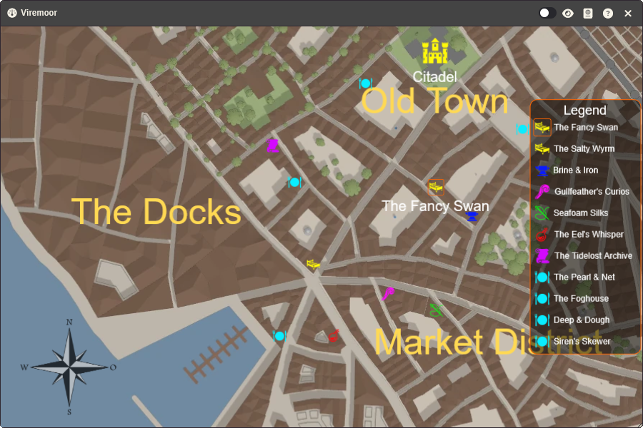
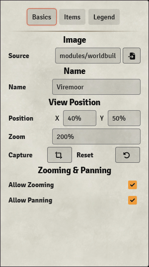
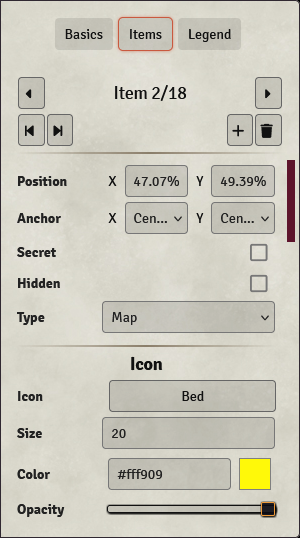

# Map Widget

The map widget displays a map (or any other kind of image or video) onto which you can place clickable icons and labels.

Take, for example, the map shown on the right. The image used here was just the map, all the icons/images and text were added as part of the map widget.

Depending on how the widget is configured, you can:

* Pan around (drag & hold the left mouse button) 
* Zoom in/out (mousewheel)
* Hover over icons to display their label
* Hover over icons to display text or a page from an article
* Click an icon to open an article

## Editing the Map Widget
You can make changes to the widget when you've opened the widget in [stand-alone mode](./widgets.md#stand-alone), you can make edits by changing to Edit Mode by pressing the slider at the top-right of the window, which will open the configuration sidebar.

The configuration sidebar has 3 tabs:

* <b>[Basics](#basics):</b> Basic widget configuration, such as the image source, widget name and view position
* <b>[Items](#items):</b> Configuring map items
* <b>[Legend](#legend_1):</b> Configurating the map legend

## Basics

In the basics tab you can configure the following:

| Option    | Description   |
|-----------|---------------|
| Source    | The source of the image. Either copy the path to the image into the textbox or press the :fontawesome-solid-file-import: button to open the image selector.  |
| Name      | Sets the name of the widget.  |
| Position  | Sets the view of the map when the widget/article is opened.  Can be given in pixels (by entering a number), or as a percentage of the map's width or height: `X: 0%` means the left edge of the map is displayed in the center. `X: 50%` means the center of the map is displayed in the center. `X: 100%` means the right edge of the map is displayed in the center.|
| Zoom      | Sets how much the map should be zoomed in when the widget/article is opened.  Can be given as a scaling factor by entering a number: `Zoom: 1` means 1 pixel of the map corresponds with 1 pixel on your screen. `Zoom: 2` means 1 pixel on the map corresponds with 2 pizels on your screen, so it's zoomed in twice.  Or can be set the zoom as a percentage of the map's width: `Zoom: 100%` means that the map is zoomed so the width is equal to the widget's width. `Zoom: 200%` means that the map is zoomed so the width is equal to 200% of the widget's width.   |
| Capture   | Capture the current view. |
| Reset     | Reset the current view to the configured view position.   |
| Allow Zooming | Allow the map to be zoomed in or out. |
| Allow Panning | Allow the map to be panned.   |

## Items

Items are icons/images or labels that can be displayed in the widget. 
They can be placed on the map, so they will stay in place relative to the map when you pan or zoom, or they can be placed as an overlay, so they will stay in the same location even when you pan or zoom.

You will need to select an item on the map or in the legend, or press the :fontawesome-solid-caret-left: or :fontawesome-solid-caret-right: buttons for the item options to show up.

### Item Navigation
The following navigation buttons are at the top of the items tab:

| Button    | Description   |
|-----------|---------------|
| :fontawesome-solid-caret-right:   | Select the next item.                                 |
| :fontawesome-solid-caret-right:   | Select the next item.                                 |
| :fontawesome-solid-caret-left:    | Select the previous item.                             |
| :fontawesome-solid-forward-step:  | Move the selected item forwards.                      |
| :fontawesome-solid-backward-step: | Move the selected item backwards.                     |
| :fontawesome-solid-plus:          | Create a new item (will duplicate the selected item). |
| :fontawesome-solid-trash:         | Delete the selected item.                             |

### Basic Configuration

| Option    | Description   |
|-----------|---------------|
| Position      | Sets the position of the icon. This can be given in pixels (by entering a number), or as a percentage of the map's dimensions (if `Type: Map`) or the widget's dimensions (if `Type: Overlay`): `X: 0%` means the icon is located on the far left. `X: 50%` means the icon is located in the center. `X: 100%` means the icon is located on the far right.|
| Icon          | Select the icon for the map item. Clicking on the button will open a drop-down menu where you can select the icon. `Select File` will allow you to choose an image file instead of one of the supplied icons. The icon can be further configured [below](#icon). |
| Source        | (Only if `Icon` is set to `Select File`) The source/path of the icon. Press :fontawesome-solid-file-import: to open the image browser.    |
| Label         | The label for the map item. Can be further configured [below](#label).    |
| Secret        | Makes the item a secret, which means that the item is only visible for users with Owner or Observer [ownership](widgets.md#ownership). Secret items will be displayed semi-opaque when in Edit Mode.   |
| Hidden        | Hides the item for everyone. Hidden items will be displayed semi-opaque when in Edit Mode. |
| Lock Position | Locks the position of the map item to prevent accidental movement.    |
| Type          | Sets the type of the icon: <b>-Map:</b> The item is located on the map (image) and moves when the map is panned/zoomed. <b>-Overlay:</b> The item is shown as an overlay and always stays in the same location. |
| Anchor        | Sets the anchor point of the item. The item's position is set at this anchor point. For example, an item is positioned at `X: 0, Y:0`: `Anchor X: Center, Anchor Y: Center` means the center of the icon is positioned on coordinate `X: 0, Y: 0`. `Anchor X: Left, Anchor Y: Top` means the top-left edge of the icon is position on coordinate `X: 0, Y: 0`.  |

### Icon
The icon can be further configured in the Icon section.

| Option    | Description   |
|-----------|---------------|
| Size      | Sets the size of the icon.    |
| Color     | Sets the color of the icon.   |

### Icon Outline
A configurable outline and background for the icon.

| Option    | Description   |
|-----------|---------------|
| Display Mode      | Sets when to display the outline and background: <b>-Show on hover:</b> Show the outline and background when hovering over the map item. <b>-Always show:</b> Always show the outline and background. <b>-Never show:</b> Never show the outline and background.    |
| Line Color        | Sets the outline color.   |
| Line Thickness    | Sets the outline thickness.   |
| Fill Color        | Sets the color of the background. |
| Fill Opacity      | Sets the opacity of the background.   |

### Label
The label can be further configured in the Label section.

| Option    | Description   |
|-----------|---------------|
| Display Mode  | Sets when to display the label: <b>-Show on hover:</b> Show the label when hovering over the map item. <b>-Always show:</b> Always show the label. <b>-Never show:</b> Never show the label.    |
| Position      | Sets the position of the label relative to the icon.   |
| Size          | Sets the size of the label.   |
| Color         | Sets the color of the label.   |
| Font Family   | Sets the font family of the label.   |

### Label Outline
A configurable outline and background for the label.

| Option    | Description   |
|-----------|---------------|
| Line Color        | Sets the outline color.   |
| Line Thickness    | Sets the outline thickness.   |
| Fill Color        | Sets the color of the background. |
| Fill Opacity      | Sets the opacity of the background.   |

### Legend
Configure how the map icon is displayed on the map [legend](#legend_1).

| Option    | Description   |
|-----------|---------------|
| Show in Legend    | Display the map item in the legend.   |
| Legend Label      | The legend label for the map item. The legend will display the 'normal' [label](#basic-configuration) if this field is left empty.    |
| Color             | Color of the legend label.    |
| Font Family       | The font family for the legend label. |

### Tooltip
A tooltip (popup) can be displayed when hovering over the map item.

| Option    | Description   |
|-----------|---------------|
| Mode      | The mode of the tooltip: <b>-Dissabled</b>: Do not display a tooltip. <b>-Text</b>: Display a configurable text. <b>-Article</b>: Display the contents of a page of an article.  |

### Click
An action can be performed when clicking on a map item.

| Option    | Description   |
|-----------|---------------|
| Mode      | The mode of the click action: <b>-Dissabled</b>: Do nothing. <b>-Open Article</b>: Open an article. <b>-View Scene</b>: View a scene. <b>-Activate Scene</b>: Activate a scene. <b>-Execute Macro</b>: Execute a macro.  |

## Legend
A legend can be displayed over the map. This legend can display one or more map items. Hovering and/or clicking on the legend items will have the same effect as hovering/clicking the map items.

| Option    | Description   |
|-----------|---------------|
| Display Legend    | Display of hide the legend.  |
| Item Size         | Sets the size of the legend items.    |
| Title             | Sets the title of the legend. |
| Title Color       | Sets the color of the title.  |
| Outline Color     | Sets the color of the legend outline. |