# Map Widget

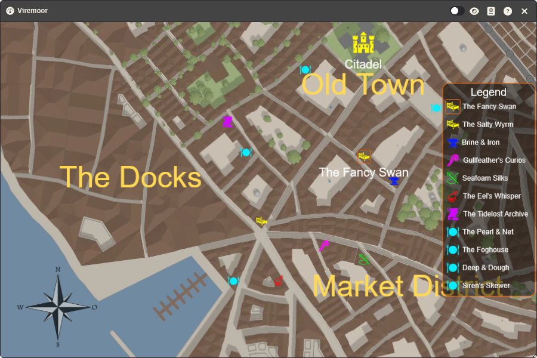

The map widget displays a map (or any other kind of image or video) onto which you can place clickable icons and labels.

Take, for example, the map shown on the right. The image used here was just the map, all the icons/images and text were added as part of the map widget.

Depending on how the widget is configured, you can:

* Pan around (drag & hold the left mouse button) 
* Zoom in/out (mousewheel)
* Hover over icons to display their label
* Hover over icons to display text or a page from an article
* Click an icon to open an article

## Editing the Map Widget
You can make changes to the widget when you've opened the widget in [stand-alone mode](./widgets.md#stand-alone), you can make edits by changing to Edit Mode by pressing the slider at the top-right of the window, which will open the configuration sidebar.

The configuration sidebar has 3 tabs:

* <b>[Basics](#basics):</b> Basic widget configuration, such as the image source, widget name and view position
* <b>[Items](#items):</b> Configuring map items
* <b>[Legend](#legend_1):</b> Configuring the map legend

### Control Buttons
When in edit mode, control buttons appear in the top-left of the widget:

* :fontawesome-solid-expand:: `Select All` mode (currently the only mode)
* :fontawesome-solid-trash:: Delete all selected items

## Basics

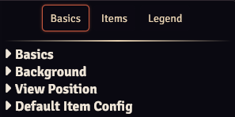

In the basics tab you can do some basic configuration of the widget:

* <b>[Basics](#basics_1):</b> Basic widget configuration, such as the widget name and dimensions
* <b>[Background](#background):</b> Widget background configuration, such as background image
* <b>[View Position](#view-position):</b> Widget view position
* <b>[Default Item Config](#default-item-config):</b> Configuring how items look by default

### Basics

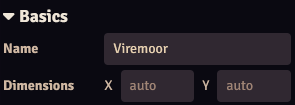

| Option    | Description   |
|-----------|---------------|
| Name          | Sets the name of the widget.  |
| Dimensions    | Dimensions of the widget (in pixels). Will default to the dimensions of the background image. |

### Background

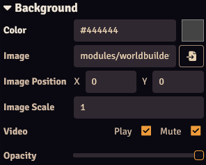

| Option    | Description   |
|-----------|---------------|
| Color     | Sets the background color of the widget. This will only be visible if no background image has been configured, or if the widget dimensions are larger than the image. |
| Image     | The image (or video) to use as the background. Either copy the path to the image into the textbox or press the :fontawesome-solid-file-import: button to open the image browser. |
| Image Position | Sets the position of the image, allowing the image to be shifted in the X or Y direction. |
| Image Scale   | Sets the scale of the image relative to the widget dimensions: `1` means the image will be scaled to fit the widget. `0.5` means the image will be half the size of the widget. |
| Video     | Sets the playback properties if a video is set as the background image: <b>-Play:</b> Autoplay the video. <b>-Mute:</b> Mute the video. |
| Opacity   | Sets the opacity of the background (color and image). |

### View Position

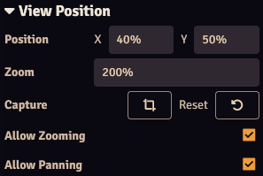

| Option    | Description   |
|-----------|---------------|
| Position  | Sets the view of the map when the widget/article is opened.  Can be given in pixels (by entering a number), or as a percentage of the map's width or height: `X: 0%` means the left edge of the map is displayed in the center. `X: 50%` means the center of the map is displayed in the center. `X: 100%` means the right edge of the map is displayed in the center.|
| Zoom      | Sets how much the map should be zoomed in when the widget/article is opened.  Can be given as a scaling factor by entering a number: `Zoom: 1` means 1 pixel of the map corresponds with 1 pixel on your screen. `Zoom: 2` means 1 pixel on the map corresponds with 2 pizels on your screen, so it's zoomed in twice.  Or can be set the zoom as a percentage of the map's width: `Zoom: 100%` means that the map is zoomed so the width is equal to the widget's width. `Zoom: 200%` means that the map is zoomed so the width is equal to 200% of the widget's width.   |
| Capture   | Capture the current view. |
| Reset     | Reset the current view to the configured view position.   |
| Allow Zooming | Allow the map to be zoomed in or out. |
| Allow Panning | Allow the map to be panned.   |

### Default Item Config
The Default Item Config section sets the default config for the map items. Item options that this can apply to can be identified with a :octicons-star-fill-16: icon, where a star outline (:material-star-outline:) indicates that the default config is used, while a filled star (:octicons-star-fill-16:) indicates that the selected item's config is used.

For example, if `Icon Size` is set to 50 in the `Default Item Config`, all items with a :material-star-outline: icon next to the `Icon Size` setting will have an icon size of 50. If you change the size of a selected item to 40, the star icon will become filled (:octicons-star-fill-16:), and that item's icon will now be of size 40. If you now change `Icon Size` in the `Default Item Config` to 100, the icons of all other items will be of size 100, while the selected item's icon will remain 40.

You can toggle between using the default or the item's config by clicking the star icon.

## Items
Items are icons/images or labels that can be displayed in the widget.

You will need to have 1 item selected for the item options to show up.

#### Creating New Items
You can create new items by:

* Clicking the :fontawesome-solid-plus: icon in the [Item Navigation](#item-navigation). If an item is selected, this item will be duplicated.
* Dragging an article onto the widget. The item's label will automatically be set to the widget's name, and the `Tooltip` and `Click` settings will be configured to display/open the article.

#### Item Selection
There are several ways to select an item:

* Clicking on the item (on the map or in the legend).
* Left click and dragging to select all items within the selection rectangle.
* Clicking the :fontawesome-solid-caret-left: or :fontawesome-solid-caret-right: buttons in the [Item Navigation](#item-navigation).

For the first 2 options, you can use the shift, ctrl and alt key to modify the current selection:

* <b>Shift or Ctrl:</b> Add the newly selected items to the previously selected items.
* <b>Alt:</b> Remove the newly selected items from the previously selected items.

#### Item Order
The item order determines in which order items are drawn, where items that are higher in the order will be drawn later, and will be drawn over any items that are lower in the order.

New items will always be added at the end of the item order (so they will be drawn on top of all existing items). 
You can move items forwards or backwards in the order with the :fontawesome-solid-backward-step: and :fontawesome-solid-forward-step: buttons in the [Item Navigation](#item-navigation).

#### Item Type
There are 2 item types, `map` and `overlay`.

Map items are drawn on the background and will remain on the same location, relative to the background image. So if you pan or zoom, map items will move together with the background.

Overlay items are drawn on a static overlay layer, which means that they do not move relative to the background image. No matter how you zoom or move the background, the items will stay in the same place. Overlay items are always drawn on top of map items, regardless of their place in the [item order](#item-order).

The item type can be configured in the [Basics section](#basics_2).

### Item Navigation

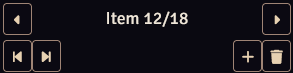

The following navigation buttons are at the top of the items tab:

| Button    | Description   |
|-----------|---------------|
| :fontawesome-solid-caret-right:   | Select the next item.                                 |
| :fontawesome-solid-caret-left:    | Select the previous item.                             |
| :fontawesome-solid-forward-step:  | Move the selected item forwards in the item order.    |
| :fontawesome-solid-backward-step: | Move the selected item backwards in the item order.   |
| :fontawesome-solid-plus:          | Create a new item (will duplicate the selected item). |
| :fontawesome-solid-trash:         | Delete the selected item.                             |

### Basics

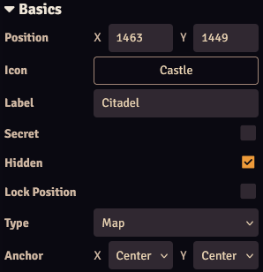

| Option    | Description   |
|-----------|---------------|
| Position      | Sets the position of the icon. This can be given in pixels (by entering a number), or as a percentage of the map's dimensions (if `Type: Map`) or the widget's dimensions (if `Type: Overlay`): `X: 0%` means the icon is located on the far left. `X: 50%` means the icon is located in the center. `X: 100%` means the icon is located on the far right.|
| Icon          | Select the icon for the map item. Clicking on the button will open a drop-down menu where you can select the icon. `Select File` will allow you to choose an image file instead of one of the supplied icons. The icon can be further configured [below](#icon). |
| Source        | (Only if `Icon` is set to `Select File`) The source/path of the icon. Press :fontawesome-solid-file-import: to open the image browser.    |
| Label         | The label for the map item. Can be further configured [below](#label).    |
| Secret        | Makes the item a secret, which means that the item is only visible for users with Owner or Observer [ownership](widgets.md#ownership). Secret items will be displayed semi-opaque when in Edit Mode.   |
| Hidden        | Hides the item for everyone. Hidden items will be displayed semi-opaque when in Edit Mode. |
| Lock Position | Locks the position of the map item to prevent accidental movement.    |
| Type          | Sets the [type](#item-type) of the icon. |
| Anchor        | Sets the anchor point of the item. The item's position is set at this anchor point. For example, an item is positioned at `X: 0, Y:0`: `Anchor X: Center, Anchor Y: Center` means the center of the icon is positioned on coordinate `X: 0, Y: 0`. `Anchor X: Left, Anchor Y: Top` means the top-left edge of the icon is position on coordinate `X: 0, Y: 0`.  |

### Icon

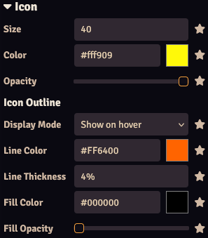

| Option    | Description   |
|-----------|---------------|
| Size      | Sets the size of the icon.    |
| Color     | Sets the color of the icon.   |
| Opacity   | Sets the opacity of the icon. |

#### Icon Outline
| Option    | Description   |
|-----------|---------------|
| Display Mode      | Sets when to display the outline and background: <b>-Show on hover:</b> Show the outline and background when hovering over the map item. <b>-Always show:</b> Always show the outline and background. <b>-Never show:</b> Never show the outline and background.    |
| Line Color        | Sets the outline color.   |
| Line Thickness    | Sets the outline thickness. Can be in pixels or as a percentage of the icon size. |
| Fill Color        | Sets the color of the outline background. |
| Fill Opacity      | Sets the opacity of the outline background.   |

### Label

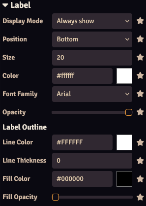

| Option    | Description   |
|-----------|---------------|
| Display Mode  | Sets when to display the label: <b>-Show on hover:</b> Show the label when hovering over the map item. <b>-Always show:</b> Always show the label. <b>-Never show:</b> Never show the label.    |
| Position      | Sets the position of the label relative to the icon.   |
| Size          | Sets the font size of the label.   |
| Color         | Sets the color of the label.   |
| Font Family   | Sets the font family of the label.   |
| Opacity       | Sets the opacity of the label.    |

#### Label Outline
| Option    | Description   |
|-----------|---------------|
| Line Color        | Sets the outline color.   |
| Line Thickness    | Sets the outline thickness.   |
| Fill Color        | Sets the color of the outline background. |
| Fill Opacity      | Sets the opacity of the outline background.   |

### Legend

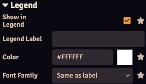

Configure how the map icon is displayed on the map [legend](#legend_1).

| Option    | Description   |
|-----------|---------------|
| Show in Legend    | Display the map item in the legend.   |
| Legend Label      | The legend label for the map item, will use the 'normal' [label](#label) if this field is left empty.    |
| Color             | Color of the legend label, will use the [label](#label) color if this field is left empty.    |
| Font Family       | The font family for the legend label. |

### Interaction

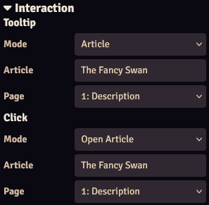

This section configures what happens when you hover over or click an item (in play mode).

#### Tooltip
A tooltip (popup) can be displayed when hovering over the map item.

| Option    | Description   |
|-----------|---------------|
| Mode      | The mode of the tooltip: <b>-Disabled</b>: Do not display a tooltip. <b>-Text</b>: Display a configurable text. <b>-Article</b>: Display the contents of a page of an article.  |
| Text      | (`Mode: Text` only) The text to display in the tooltip. Can be formatted as HTML. |
| Article   | (`Mode: Article` only) Article to display in the tooltip. |
| Page      | (`Mode: Article` only) Page of the selected article to display in the tooltip, will default to the first page if unconfigured. |

#### Click
An action can be performed when clicking on a map item.

| Option    | Description   |
|-----------|---------------|
| Mode      | The mode of the click action: <b>-Disabled</b>: Do nothing. <b>-Open Article</b>: Open an article. <b>-View Scene</b>: View a scene. <b>-Activate Scene</b>: Activate a scene. <b>-Execute Macro</b>: Execute a macro.  |
| Article   | (`Mode: Article` only) Article to display in the tooltip. |
| Page      | (`Mode: Article` only) Page of the selected article to display in the tooltip, will default to the first page if unconfigured. |
| Scene     | (`Mode: View Scene` or `Mode: Activate Scene` only) Scene to view/activate. |
| Macro     | (`Mode: Macro` only) Macro to execute.    |

## Legend

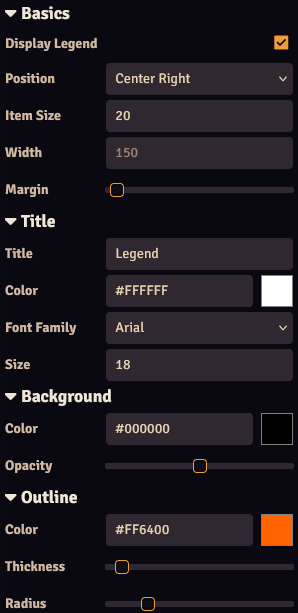

A legend can be displayed over the map. This legend can display one or more map items. Hovering and/or clicking on the legend items will have the same effect as hovering/clicking the map items.

### Basics
| Option    | Description   |
|-----------|---------------|
| Display Legend    | Display or hide the legend.  |
| Position          | Position of the legend. |
| Item Size         | Sets the size of the legend items.    |
| Width             | Width of the legend. If left empty the width will be automatically determined by the contents. |

### Title
| Option    | Description   |
|-----------|---------------|
| Title             | Sets the title of the legend. |
| Title Color       | Sets the color of the title.  |
| Font Family       | Sets the font family of the title. |
| Size              | Sets the font size of the title.  |

### Background
| Option    | Description   |
|-----------|---------------|
| Color     | Sets the background color of the legend. |
| Opacity   | Sets the background opacity of the legend.    |

### Outline
| Option    | Description   |
|-----------|---------------|
| Color     | Sets the color of the legend outline. |
| Thickness | Sets the line thickness of the legend outline.    |
| Radius    | Sets the corner radius of the legend outline. |